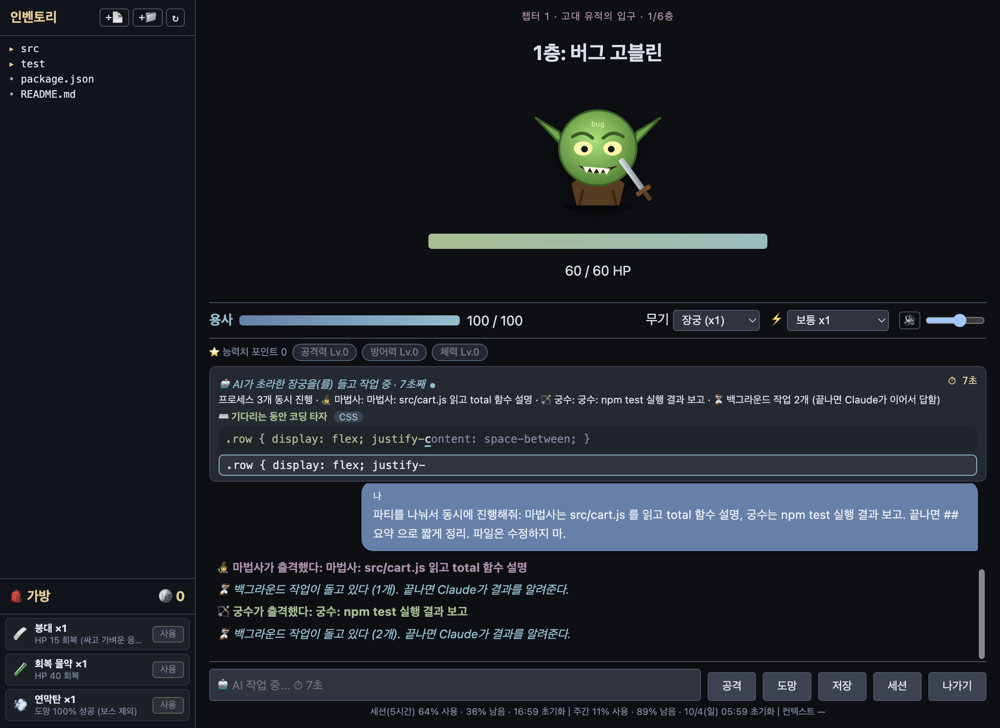
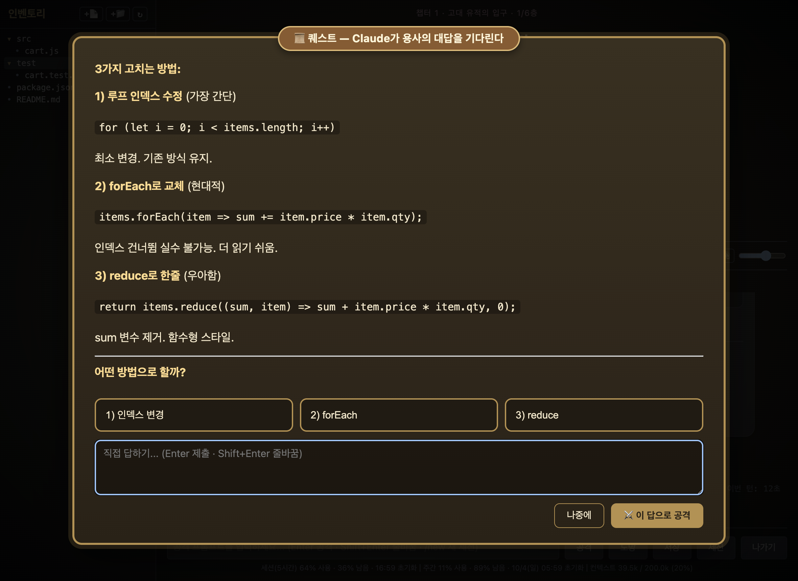

# Prompt Battle

**English** | [한국어](README.md)

A turn-based RPG wrapped around real AI coding. Every prompt you type is an attack — longer, more specific prompts hit harder — while the game actually reads/writes files and runs commands in your project via the Claude Agent SDK.

## Features

- **Prompts are attacks** — longer prompts and keywords ("step by step", "test", "edge case", "refactor", "why", "example") deal more damage; 2+ different keywords is a critical hit. Korean equivalents count too (단계별, 테스트, 엣지 케이스, 리팩토링, 왜, 예시, ...).
- **Real-time hits (work = damage)** — every successful command/edit lands its own hit as it completes (25% of the prompt damage, 1–12) and the full prompt damage closes the turn; failed actions don't hit. **⏹ Stop** ends a turn right away, and **your latest message** is shown beside the monster; touched files fly at the monster as their real OS icon.
- **XP bar** — shows how far you are toward the next level (every 100 XP), like an HP bar; it fills as you defeat monsters mid-run, with a level-up message.
- **Monster speech bubbles** — monsters talk: idle chatter that keeps changing, plus their own lines when hit, attacking, dying and more; the merchant and blacksmith chat too.
- **Player HP** — a monster that survives your turn strikes back (harder if you hesitate or your turn errors). 0 HP = defeat. Clearing a floor heals you.
- **Classes & weapons = Claude models** — pick a class on the setup screen (🗡 swordsman / 🧙 wizard / 🏹 archer); each names the model-weapons differently and attacks with its own lines. Stronger models hit harder (x0.8 – x1.5); switch any time mid-run.

  | Model | 🗡 Swordsman | 🧙 Wizard | 🏹 Archer |
  |---|---|---|---|
  | Haiku (x0.8) | 단검 dagger | 나무 완드 wooden wand | 단궁 short bow |
  | Sonnet (x1) | 장검 longsword | 마법지팡이 magic staff | 장궁 longbow |
  | Opus (x1.25) | 마검 demon blade | 현자의 지팡이 sage's staff | 마궁 demon bow |
  | Fable (x1.5) | 성검 holy sword | 대마도사의 오브 archmage's orb | 천궁 heavenly bow |

  Each enhance level changes the weapon's prefix: 초라한 (shabby) → 그냥 (plain) → 쓸만한 (decent) → … → 전설의 (legendary) → 신화의 (mythic), e.g. `초라한 마법지팡이 +0` → `그냥 마법지팡이 +1`.
- **Story themes & chapters** — Adventure / Hunt the Demon King / Bug Sweep. Every 6th floor is a chapter boss; clearing it continues the story, and your progress is saved so the next run picks up where you left off.
- **Inventory** — the sidebar shows your project's file tree; open any file to view or edit and save it. **Drag** files/folders onto another folder to move them, and **drop files from Finder** to copy them in (a name clash becomes `name (1)`). `+📄` / `+📁` create a new file/folder inside the selected folder. Everything stays inside the project folder and nothing is overwritten. ↻ refresh re-reads the tree with an animation.
- **AI party (subagents)** — three Claude subagents: 🧙 wizard (explore/research), 🗡 swordsman (implement), 🏹 archer (test/verify). When the AI splits work and sends several **at once**, the screen shows "N processes running" and what each is doing. The wizard's work strikes as spirits, the archer's as companions, the swordsman's as a blade under the archer's cover fire. Can be turned off on the setup screen (it uses more tokens).
- **Turn timer & coding typing drills while you wait** — the status line and the input show how long the AI has been working. Meanwhile, type a random line of code (80+ drills across 20+ languages/tools: JavaScript, Python, Go, Rust, SQL, Git, Docker…) exactly to deal 1 damage; a 3-second explanation of that code follows (tap for the long one), then the next line. Speed and accuracy are shown. The **⚙️ language** button in the drill area limits drills to the languages you pick (C, C++, Python…).
- **BGM & sound effects** — 8 tracks made with Suno: title, a battle track per theme (adventure / demon king / bug sweep), boss, merchant shop, blacksmith, and a quest theme (when the AI asks you something); looped, crossfading between scenes. Short effects (hits, crits, damage taken, coins, enhance success/fail/break, typing) are synthesized. 🔊 button and volume slider.
- **Claude settings** — on the setup screen: 🔑 connection (Claude Code login or an API key, stored encrypted in the keychain), ⚡ attack speed (= effort, low x0.85 … max x1.2, switchable mid-battle), 🧩 skills all/none/pick (searchable), 🔌 MCP servers on/off each. Game sessions only; your Claude Code settings are untouched.
- **Long jobs go to the courier** — builds, full test suites, installs, training and other long work are handed to the 🦅 courier subagent in the background; the turn waits, with no time limit, for Claude's follow-up answer.
- **Quest window** — when the AI needs an answer from you, it asks in a large quest window; pick a choice or type your own to attack with it.
- **Game bag** — under the file inventory, a 🎒 bag to use bandages (+15 HP), potions (+40 HP), whetstones, amulets and smoke bombs as free actions.
- **Tool cards** — commands (Bash), file edits and reads the AI runs appear as cards distinct from chat bubbles: IN (the command) and OUT (the result), running/done/failed status, long output collapsible.
- **Readable AI output** — replies are **typed out live** into a chat bubble as the AI streams them, with clean markdown (headings, lists, code, tables), and **important parts colored**: bold text, success/pass (green), failure/error (red), warnings (yellow), file paths (blue), and syntax-highlighted code blocks. Your messages sit in right-hand bubbles and the log jumps to the bottom when you send. The input grows for long, multi-line prompts (Shift+Enter newline, Enter attack). A question followed by a list becomes clickable choices.
- **Sessions** — after picking a folder, choose which of its Claude Code sessions to resume (terminal `claude` sessions included) or start a new one. Mid-run, the `세션` (session) button **swaps** to another session and shows its transcript in the log. Each session also **autosaves the game state** (floor, HP, monster HP, stats…), so resuming a session resumes the run. When the context passes 80%, the game shows a ready-made `/new ...` prompt to continue in a new session. Game sessions also **appear in VS Code's Claude Code session list and `claude --resume`**: SDK-started sessions are normally hidden there, so after each turn the game relabels only the `entrypoint` field of the local transcript (`~/.claude/projects/…/<session-id>.jsonl`) to `cli`. Conversation content is untouched, and usage was already reported as SDK.
- **Save / load (3 slots + autosave)** — a 4th slot is written automatically at the start of every floor. in battle, `저장` (save) stores floor, HP, coins, bag, stats, sword level and the Claude session into a slot (free action). `불러오기` (load) on the setup screen restarts that folder, theme and weapon from the saved floor (including the HP of the monster you were fighting).
- **Chat history** — your prompts and the AI's replies are saved per folder and shown when you open that folder again.
- **Coins & merchant goblin** — clearing a floor earns coins (bosses pay 3x). After a clear, a merchant goblin sometimes (30%) appears selling a potion (+40 HP), whetstone (next attack x2), amulet (blocks one counterattack), smoke bomb (guaranteed escape) and life crystal (+10 max HP, permanent). Bag items are free actions. The merchant also runs an **odd/even dice game**: bet coins on odd or even, win double or lose the stake.
- **Stat growth (per run)** — stats start at Lv.0 every run. Every monster defeated grants a stat point; spend it in battle on attack (+10% damage per level), defense (-5% counterattack damage per level) or vitality (+10 max HP per level), each capped at Lv.10. They reset when the run ends; loading a save slot brings that run's stats back. (Sword level and life-crystal max HP are permanent.)
- **Sword enhancement (blacksmith)** — after a clear you sometimes (20%) meet a blacksmith. Pay coins to enhance your weapon (+10% damage per level, max +10). The higher it goes the lower the success rate (+0→+1: 95% … +9→+10: 14%), and from +3 a failure can **break the weapon back to +0 (shabby)** (10%–40%).
- **Usage bar** — a small line at the bottom shows how much of your Claude plan's 5-hour session limit and weekly limit is used/left and when each resets, plus the current conversation's context tokens (used/max). Refreshes after each turn; click to refresh. (Plan limits come from the SDK as percentages, not token counts; hidden with an API key.)
- **Flee vs. Exit** — fleeing has a 50% chance: success skips to the next floor with no reward, failure wastes the turn and draws a counterattack. You can't flee a boss. The Exit button offers "end today's adventure" (saves floor, coins, bag and session so you resume from that floor) or "keep playing".

## Tour

### 1. Setup


Pick a project folder, a theme, a **class** (🗡 swordsman / 🧙 wizard / 🏹 archer — it renames your weapons), a weapon (Claude model) and a difficulty. After picking a folder, its Claude sessions are listed (with 💾 the autosaved floor/HP), and the 3 save slots can be **loaded**. Under **⚙️ Claude settings**:

- 🔑 **Connection**: the Claude Code login (CLI) or an **API key** (stored encrypted in the keychain, with a "check connection" button)
- ⚡ **Attack speed = effort**: very fast (low, x0.85 damage) … very slow (max, x1.2)
- 🧩 **Skills**: all / none / pick (searchable)
- 🔌 **MCP servers**: on/off per server, with connection status

These apply only to the game's sessions; your Claude Code settings are untouched.

### 2. Battle


- **Top left, inventory**: the project's file tree — drag to move, drop files from Finder, `+📄` `+📁` to create, click to view/edit (⌘S saves; closing with unsaved edits asks first).
- **Bottom left, 🎒 bag**: bandages, potions, whetstones, amulets, smoke bombs — `사용` (use) is a free action.
- **Middle**: the monster and its HP, your HP, weapon (model) and ⚡ attack speed switchers, ⭐ stat points (+1 per monster defeated).
- **Log**: your bubbles (right), the AI's replies (left — typed live, markdown, important parts colored), and the commands/edits/reads it runs as separate **tool cards** (IN/OUT, done/failed).
- **Bottom**: a multi-line input (Enter attacks, Shift+Enter newline), `공격` attack · `도망` flee (50%) · `저장` save · `세션` switch session · `나가기` exit, and a small usage line (5-hour/weekly plan limits, context tokens).

### 3. While the AI works: party + typing drills


A live timer, the **AI party** (🧙 wizard explores · 🗡 swordsman implements · 🏹 archer verifies) with how many processes run at once, and how many background tasks are pending. Long jobs go to the 🦅 **courier** subagent in the background, and Claude follows up with the result when it's done. Meanwhile, **type a line of code** exactly for 1 damage plus an explanation of that code (tap for more).

The **👥 agents** tab (top right) lists the last 10 subagents: how long running ones have been going, how long finished ones ran, and on click their job, actions (✓/✗) and final report.

### 4. Quests (when the AI asks you something)


When the AI needs your answer, a large quest window opens. Pick a choice or write your own, and **attack with that answer**.

### 5. Merchant goblin


Sometimes appears after a clear. Buy items with coins, or gamble on 🎲 odd/even (win double; `올인` = all-in). Typing a prompt here closes the shop and attacks the next monster.

### 6. Blacksmith


Enhance your weapon with coins (up to +10). Success gets less likely as it climbs, and from +3 a failure can break it back to +0 (shabby). Each level changes the weapon's prefix (초라한 shabby → 그냥 plain → … → 신화의 mythic).

### 7. Exit


"End today's adventure" or "keep playing". Ending saves your floor, coins, bag, weapon level, and this folder's Claude session and chat history. Each session also autosaves the game state, so resuming a session resumes the run.

## Mac App

```bash
git clone https://github.com/tpgusgh/prompt-engineering-is-game.git
cd prompt-engineering-is-game
npm install
npm run electron:build
```

This produces a `.dmg` under `release/`. Open it and drag Prompt Battle into Applications, or run the built `.app` directly.

**First launch:** macOS may say the app "cannot be opened because the developer cannot be verified" — it isn't notarized (that needs a paid Apple Developer account). Right-click the app → Open, then confirm. Only needed once. (If your machine has an Apple Development signing identity, `electron-builder` uses it automatically and you may see no warning.) Apple Silicon (arm64) only for now.

## CLI

```bash
npm install
npm link
promptbattle --difficulty normal
```

Run it inside the project you want to work on. Type `/quit` to leave, `/flee` to try escaping (50%), `/new <prompt>` to start a fresh session, `/use <item>` to use an item, and `/buy <item>`, `/bet odd|even <coins>`, `/leave` at the merchant, `/enhance` at the blacksmith, and `/stat attack|defense|vitality`, `/save 1-3`, `/session <id>` any time. Requires Node.js >= 22.18.0 (native TypeScript execution, no build step). A published `npm install -g` copy won't work — Node refuses to type-strip `.ts` under `node_modules` — so use `npm link` from a clone.

## Versions / releases

Versions are published as [GitHub Releases](https://github.com/tpgusgh/prompt-engineering-is-game/releases), each with the `.dmg` attached, so you can install without building. Changes are listed in [CHANGELOG.md](CHANGELOG.md).

Cutting a release (maintainers):
```bash
npm version minor        # bump package.json and create the vX.Y.Z tag
npm run release          # test → build .dmg → push the tag → GitHub release with the .dmg
```

## Setup

No API key needed: the game reuses the Claude Code login already on your machine (e.g. a Claude subscription). Prefer an API key? Set `ANTHROPIC_API_KEY` and the SDK uses that instead. Note that an app launched from Finder doesn't inherit shell environment variables, so the Claude Code login is the reliable path for the Mac app.

## Safety

The agent runs with full autonomous file/command permissions (no per-action confirmation), like `claude --dangerously-skip-permissions`. Only point it at projects you trust. Tool access is limited to Read/Write/Edit/Bash/Glob/Grep. Each run is one continuing Claude Code session, so context and cost grow across floors like a long `claude` session.

## Limitations

- Ctrl+C in the CLI ends the run and saves like `/quit`, but a turn already in flight finishes first (with full permissions).
- No npm registry publish yet — install from the repo.
