<p align="center"></p>

# Prompt Battle

**English** | [한국어](README.md) | [日本語](README.ja.md)

A turn-based RPG wrapped around real AI coding. Every prompt you type is an attack — longer, more specific prompts hit harder — while the game actually reads/writes files and runs commands in your project via the Claude Agent SDK.

## Features

- **Prompts are attacks** — better prompts hit harder. Length sets the base (10 + 1 per 8 characters, up to 40); each of **7 good-prompt criteria** met adds **+50%**, and 3 or more is a **critical ×1.5** (up to 270): 🎯 target (name the file, function or `code` — `src/app.ts`, `login()`) · 🧱 limits (only, must, don't, without, keep) · ✅ verify (test, verify, pass) · 🪜 steps (step by step, first … then, a 1. 2. list) · 🧐 why (why, because, so that) · 📎 example (example, e.g.) · ⚠️ edge cases (edge/corner case, null, empty, error handling). The criteria you've met light up under the input as you type, with the **estimated damage** (weapon, sword and whetstone included). Under 50 characters the criteria count half and can't crit (no keyword lists). Korean and Japanese forms count too.

  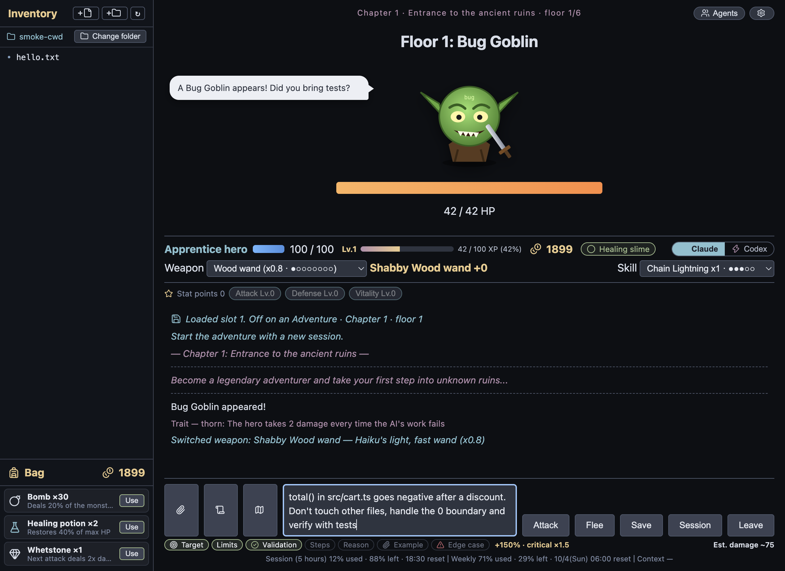
- **Real-time hits (work = damage)** — every successful command/edit lands its own hit as it completes (25% of the prompt damage, 1–12) and the full prompt damage closes the turn; failed actions don't hit. **⏹ Stop** ends a turn right away, and **your latest message** is shown beside the monster; touched files fly at the monster as their real OS icon.
- **XP bar, level rewards, titles** — shows how far you are toward the next level (every 100 XP), like an HP bar; each new run starts with **one stat point per hero level**, and your title changes with level (견습 용사 apprentice … 전설의 프롬프터 legendary prompter); it fills as you defeat monsters mid-run, with a level-up message.
- **3 themes that play differently** — pick one to see its perks and difficulty.
  - 모험을 떠나기 / adventure (★☆☆): every area in turn, shops 1.5x as often, three areas of its own
  - 마왕 잡으러 가기 / demon king (★★★): the demon army from chapter 1, boss HP +30%, coins and XP x1.5, three areas of its own
  - 버그 소탕전 / bug hunt (★★☆): +25% closing blow on a turn whose tests passed, +20% counter after a failed tool call, three areas of its own
  - Each theme has a 10–11 chapter story; difficulty (easy/normal/hard) scales monster HP x0.7 / x1 / x1.4 and coins/XP x0.7 / x1 / x1.5.
- **102 monsters & a bestiary** — each chapter brings 6 monsters (the last is the boss): 8 shared areas plus 3 per theme — bug goblin, SQL-injection vampire, floating-point ghost, rootkit demon king, heisenbug moth, N+1 query octopus, force-push captain, the node_modules black hole and more. The bestiary filters by all (per area) or per theme (chapter order). The **📖 bestiary** shows every monster you've met — art, HP, counterattack, boss rule, kills; unmet ones are silhouettes, and defeated ones open a detail page with their trait, personality and lines. Every monster has a **trait**: armor (work hits halved), regen (heals every turn), fierce (+30% counter), thorns (failed tool calls hurt you), frail (+25% closing blow), keyword-weak (+30% crits), test-weak (x1.5 closing blow on a turn whose tests passed).
- **📅 Daily dungeon** — one a day, the same for everyone: the date picks the theme, each chapter's area, and the merchant/chest/flee rolls. Normal difficulty, from floor 1, no saving. Fall and post to the **daily board** (story progress is untouched).
- **🌟 Rebirth** — from level 20, **Rebirth** on the start screen sends you back to level 1 for a star: each star is +10% damage and coins and +2 starting stat points, for good. Coins, sword, pets and the bestiary stay.
- **🐾 Pets** — rare in gold-or-better chests (3–20%), kept for good; pick one on the start screen: healing slime (5% max HP per turn), baby drake (3% of the monster's max HP per turn), wise owl (+20% floor XP).
- **🏮 Night market** — a stall that opens 10% of the time after a clear: 4 goods, boss relics and contracts included, 30–70% off today's price, one of each.
- **Rest stops** — a **healing spring** (5%, 50% max HP once; not in the adventure theme) and, while bound, a **shrine** (10%) to renounce your pact with no max-HP penalty. After a clear: merchant 35% (adventure 40%) · blacksmith 30% · night market 10% · spring 5% · shrine 10% · nothing 10–20%.
- **Story & effects** — a prologue card per theme, boss entrance and awakening lines, chapter-clear story cards; floating damage numbers and sparkles/flashes on crits, chests, clears, level-ups and awakenings.
- **📜 Skillbook** — 📜 by the input. Write frequent instructions as **Claude skill files** (`.claude/skills/<name>/SKILL.md`), edit and delete them; **Load** puts `/<name>` in front of the prompt and Claude runs that skill. Your `~/.claude/skills` show up too (load only).
- **Boss rules & phase 2 awakening** — below half HP a boss **awakens** once, differently per area: rage (+30% counters) · regen (4% max HP a turn) · steel skin (-25% damage taken) · frenzy (two counters at 60%) · vampire (heals what its counter dealt). Bosses drop their own **relic** 30% of the time (17 of them: next hit ×2.5–4, block 2–3 counters, heals, % blasts, XP, coins). Every chapter boss also has a rule: it heals when a tool fails / only takes damage from a turn whose tests passed / needs 3+ file edits in a turn / needs a prompt of 120 characters or fewer.
- **Achievements, daily quest, records** — 27 achievements (first boss, 10 crits, sword +5, full bestiary, Pact Breaker (force-break a pact), Bitten by the Pact, God of Typing (700 CPM), Rich (3,000 coins), Clean-Sweep Customer (buy out a merchant), Night Market Regular, Two-Timer (Claude and Codex in one run)…) that pay coins, a daily quest ("pass tests 3 times"…), and **📊 records**: tokens processed, best hit, longest turn, **records by AI** (win rate, tokens and best hit for Claude, Codex, Grok and Gemini), win rate per weapon (model). The ranking shows the AI that fought most of a run next to the name.
- **Treasure chests** — if a monster hits 0 HP while the AI is still working, it falls on the spot and turns into a treasure chest; the rest of the work, the closing blow and typing hits pile onto it, and the overkill sets the grade: measured as a share of the monster's max HP, across 8 grades: wood (0%) · iron (15%) · silver (35%) · gold (70%) · platinum (120%) · diamond (200%) · legendary (300%) · mythic (500%+). Coins always; items by chance (5% for wood up to 95% for mythic), better loot in better chests.
- **"AI is done" notification** — when the game window isn't in front and the AI finishes, a notification (click to return), a Dock bounce on Mac / taskbar flash on Windows. Toggle in ⚙️ Settings → sound & notifications.
- **Shop & items** — the merchant shelves 4 items at a time, rotating each visit, and buys bag items back at half price. Besides bandages, potions, whetstones, amulets, smoke bombs and life crystals: elixir (full heal), bomb (20% of the monster's max HP, 5% on bosses, at least 30), scroll of wisdom (+30 XP), the **coin charm** (+25% coins for good, one purchase only), the **contract** and the **devil's contract**.
- **Contracts** — a contract binds you to one of 6 elemental gods at random (+5% to every hit plus the god's trait, all as percentages); a devil's contract to one of the 7 deadly-sin demons, costing 10–30% of max HP to sign, each with its own trait. You hold one pact at most: using another scroll while bound breaks them all and costs **10% of max HP for the rest of that run**. A pact lasts one run: a new run starts without one, and with an empty bag (loading a save brings back that run's pact and bag). The merchant only rarely (10% a visit) shelves a contract or a devil's contract.
- **Attach files & pictures** — 📎 beside the input, drag & drop onto it, or paste an image (⌘/Ctrl+V). Claude sees pictures, reads PDFs as documents and gets code/text files inline (5 at a time; images 5MB, PDFs 30MB, text 200KB).
- **Next-prompt memo** — jot the next prompt in the 📝 memo while the AI fights; when the turn ends it moves into the input box.
- **🖥 Servers** — **🖥 Servers** next to **👥 Agents** above the battle. Dev servers the AI started in the project folder (processes listening on a port) show with their ports and command; open one with **🌐 localhost:port** or stop it with **⏹ Force off**. For a server writing to a log file, **📜 Log** shows its last lines and **🔄 Restart** runs the same command again (Mac, Linux). The AI is told to start servers detached and end its turn, so a server never holds the turn open.
- **Change folder mid-run** — **📁 폴더 바꾸기** above the inventory switches the project folder: the file tree follows and Claude carries on in a fresh session there (not while the AI is working).
- **👑 Title shop** — **👑 Titles** on the start screen. Spend coins from achievements and runs on 21 titles (Caffeine Addict 200 to Bought This Title 10,000), kept for good. The one you wear shows in the ranking and on your profile instead of your level title. Each tier (common, rare, epic, legendary) has its own color in the ranking, and some titles (Dragon Slayer, God of the Keyboard, Monster Doctor...) unlock with an achievement.

  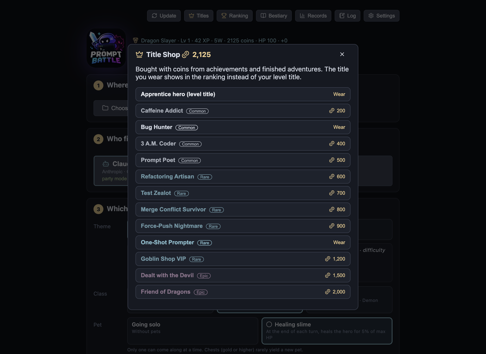
- **Online ranking** — when you fall, enter a name on the summary screen to post your score ((floor reached×100 + chapters cleared×400 + XP) × difficulty). **All-time · This week · Daily** tabs keep 100 each and filter by theme and difficulty, with titles (a bought one if worn) and rebirth stars; click a row for the run's details. View them with **🏆 Ranking** on the start screen. Only released apps can post: the signing key is added at build time, and the server checks a single-use per-run token and recomputes the score. The Vercel backend is in [`server/`](server/README.md).
- **Fatigue** — when Claude usage (the busier of the 5-hour and weekly windows) passes 75% the hero is "tired"; past 90% a red **fatigue danger** badge and warning appear (the AI may stop soon).
- **Run summary** — at the end of a run: kills, XP, coins, best hit, tests passed, longest turn and more, as tidy cards.
- **Monster speech bubbles** — monsters talk: idle chatter that keeps changing, plus their own lines when hit, attacking, dying and more; the merchant and blacksmith chat too.
- **Player HP** — a monster that survives your turn strikes back (harder if you hesitate or your turn errors) — unless the AI ends its reply with a question for you; then the monster waits for your answer. 0 HP = defeat. Clearing a floor heals you.
- **Class skills = effort** — how hard Claude thinks (effort) is picked as your class's skill: higher skills are slower but hit harder (x0.85 … x1.2) and use more tokens. Pick it under the weapon on the start screen, or beside the weapon mid-battle.
  - Swordsman: 빠른 베기 → 연속 베기 → 회전 베기 → 검기 폭풍 → 천검
  - Wizard: 매직 미사일 → 파이어볼 → 체인 라이트닝 → 블리자드 → 메테오 (meteor)
  - Archer: 속사 → 관통 화살 → 연발 사격 → 화살비 → 천공의 화살
- **Classes & weapons = Claude models** — pick a class on the setup screen (🗡 swordsman / 🧙 wizard / 🏹 archer); each names the model-weapons differently and attacks with its own lines. Stronger models hit harder (x0.8 – x1.5); switch any time mid-run.

  | Model | 🗡 Swordsman | 🧙 Wizard | 🏹 Archer |
  |---|---|---|---|
  | Haiku (x0.8) | 단검 dagger | 나무 완드 wooden wand | 단궁 short bow |
  | Sonnet (x1) | 장검 longsword | 마법지팡이 magic staff | 장궁 longbow |
  | Opus (x1.25) | 마검 demon blade | 현자의 지팡이 sage's staff | 마궁 demon bow |
  | Fable (x1.5) | 성검 holy sword | 대마도사의 오브 archmage's orb | 천궁 heavenly bow |

  Each enhance level changes the weapon's prefix: 초라한 (shabby) → 그냥 (plain) → 쓸만한 (decent) → … → 전설의 (legendary) → 신화의 (mythic), e.g. `초라한 마법지팡이 +0` → `그냥 마법지팡이 +1`.
- **Story themes & chapters** — Adventure / Hunt the Demon King / Bug Sweep. Every 6th floor is a chapter boss; clearing it continues the story, and your progress is saved so the next run picks up where you left off.
- **Inventory** — the sidebar shows your project's file tree; open any file to view or edit and save it. **Drag** files/folders onto another folder to move them, and **drop files from Finder** to copy them in (a name clash becomes `name (1)`). `+📄` / `+📁` create a new file/folder inside the selected folder. Everything stays inside the project folder and nothing is overwritten. ↻ refresh re-reads the tree with an animation.
- **AI party (subagents)** — three Claude subagents: 🧙 wizard (explore/research), 🗡 swordsman (implement), 🏹 archer (test/verify). When the AI splits work and sends several **at once**, the screen shows "N processes running" and what each is doing. The wizard's work strikes as spirits, the archer's as companions, the swordsman's as a blade under the archer's cover fire. Toggle **party mode** in ⚙️ Settings → AI party (it uses more tokens; works mid-run too).
- **Turn timer & coding typing drills while you wait** — the status line and the input show how long the AI has been working. Meanwhile, type a random line of code (80+ drills across 20+ languages/tools: JavaScript, Python, Go, Rust, SQL, Git, Docker…) exactly to deal 1 damage; a 3-second explanation of that code follows (tap for the long one), then the next line. Speed and accuracy are shown. The **⚙️ language** button in the drill area limits drills to the languages you pick (C, C++, Python…).
- **BGM & sound effects** — 8 tracks made with Suno: title, a battle track per theme (adventure / demon king / bug sweep), boss, merchant shop, blacksmith, and a quest theme (when the AI asks you something); looped, crossfading between scenes. Short effects (hits, crits, damage taken, coins, enhance success/fail/break, typing) are synthesized. 🔊 button and volume slider.
- **🤖 Claude · ⚡ Codex · ✦ Grok · ◆ Gemini** — pick the AI you fight with (start screen step 2; mid-battle, the switch by the weapon). Same four tiers: Claude Haiku·Sonnet·Opus·Fable / Codex Luna·Terra·Sol·Astra (each family's newest model, no version numbers) / Grok's lighter model at low·high effort and its stronger model at medium·high effort / Gemini Flash-Lite·Flash·Auto·Pro (the Gemini CLI's aliases, so always the newest model). Claude and Codex still have a separate effort skill; for Grok and Gemini the weapon is the whole setting, so the skill does not stack. Switching keeps each AI's own session and hands it what was said with the other meanwhile (the files are the same folder). Codex needs a one-time ChatGPT sign-in. Grok needs the `grok` CLI signed in with SuperGrok (or an API key). Gemini needs the [Gemini CLI](https://github.com/google-gemini/gemini-cli) (`npm i -g @google/gemini-cli`): run `gemini` once in a terminal and sign in with Google (or set `GEMINI_API_KEY`). Safe mode works with Claude and Gemini (for Gemini the game adds a hook for that turn only, without touching your `~/.gemini` settings). Grok can't ask before each command, so it is off in safe mode.
- **⚙️ Gear slots** — wear up to 2 boss relics instead of using them up, for a lasting effect by kind: damage +10% · counters taken -10% · 2% HP per turn · work hits +15% · XP +10% · coins +10%. **Equip** in the bag; click a badge to take it off.
- **📓 Adventure log** — per project folder, day by day: turns, kills, tests passed, tokens, files touched and prompts sent. **📓 Log** on the start screen or <kbd>Ctrl/⌘</kbd>+<kbd>J</kbd>.
- **⌨️ Shortcuts** — <kbd>1</kbd>–<kbd>9</kbd> bag items, <kbd>Esc</kbd> close / stop the AI, <kbd>Ctrl/⌘</kbd>+<kbd>K</kbd> skillbook, <kbd>?</kbd> help.
- **🎓 Tutorial** — the first launch walks through the start screen and the first battle, step by step; replay it from Settings → 👁 Display.
- **👁 Display (accessibility)** — large text, colour-blind mode (orange/blue instead of red/green), reduced effects (no shake, sparkles or flashes).
- **🌐 Language** — 한국어 · English · 日本語, picked with 🌐 at the top of the settings window and applied right away (the first run follows your system language). Claude answers in the language you write in. Game text is collected by `scripts/i18n-extract.mjs` and translated through `electron/renderer/i18n/<lang>.json`.
- **⚙️ Settings window** — the same window from the start screen and in battle (⚙️ top right). Claude tab: 🔑 connection (Claude Code login or an API key, stored encrypted in the keychain), 🧩 Claude skills all/none/pick (searchable), 🔌 MCP servers on/off each. Game sessions only; your Claude Code settings are untouched. Plus AI party, 🔊 sound (volume/mute) and ⌨️ typing-drill language tabs.
- **Long jobs go to the courier** — builds, full test suites, installs, training and other long work are handed to the 🦅 courier subagent in the background; the turn waits, with no time limit, for Claude's follow-up answer.
- **Quest window** — when the AI needs an answer from you, it asks in a large quest window; pick a choice or type your own to attack with it.
- **Game bag** — under the file inventory, a 🎒 bag to use bandages (15% max HP), potions (40% max HP), whetstones, amulets and smoke bombs as free actions.
- **Tool cards** — commands (Bash), file edits and reads the AI runs appear as cards distinct from chat bubbles: IN (the command) and OUT (the result), running/done/failed status, long output collapsible.
- **Readable AI output** — replies are **typed out live** into a chat bubble as the AI streams them, with clean markdown (headings, lists, code, tables), and **important parts colored**: bold text, success/pass (green), failure/error (red), warnings (yellow), file paths (blue), and syntax-highlighted code blocks. Your messages sit in right-hand bubbles and the log jumps to the bottom when you send. The input grows for long, multi-line prompts (Shift+Enter newline, Enter attack). A question followed by a list becomes clickable choices.
- **Sessions** — after picking a folder, choose which of its Claude Code sessions to resume (terminal `claude` sessions included) or start a new one. Mid-run, the `세션` (session) button **swaps** to another session and shows its transcript in the log. Each session also **autosaves the game state** (floor, HP, monster HP, stats…), so resuming a session resumes the run. When the context passes 80%, the game shows a ready-made `/new ...` prompt to continue in a new session. Game sessions also **appear in VS Code's Claude Code session list and `claude --resume`**: SDK-started sessions are normally hidden there, so after each turn the game relabels only the `entrypoint` field of the local transcript (`~/.claude/projects/…/<session-id>.jsonl`) to `cli`. Conversation content is untouched, and usage was already reported as SDK.
- **Save / load (3 slots + autosave)** — a 4th slot always holds the latest state automatically (a wounded monster stays wounded). in battle, `저장` (save) stores floor, HP, coins, bag, stats, sword level and the Claude session into a slot (free action). `불러오기` (load) on the setup screen restarts that folder, theme and weapon from the saved floor (including the HP of the monster you were fighting).
- **Chat history** — your prompts and the AI's replies are saved per folder and shown when you open that folder again.
- **Coins & merchant goblin** — clearing a floor earns coins (bosses pay 3x). After a clear, a merchant goblin sometimes (30%) appears selling a potion (40% max HP), whetstone (next attack x2), amulet (blocks one counterattack), smoke bomb (guaranteed escape) and life crystal (+10% max HP for that run). Bag items are free actions. The merchant also runs an **odd/even dice game**: bet coins on odd or even, win double or lose the stake.
- **Stat growth (per run)** — stats start at Lv.0 every run. Every monster defeated grants a stat point; spend it in battle on attack (+10% damage per level), defense (-5% counterattack damage per level) or vitality (+10% max HP per level, compounding), each capped at Lv.10. They reset when the run ends; loading a save slot brings that run's stats back. (Only the sword level is permanent; life crystals last one run too.)
- **Sword enhancement (blacksmith)** — after a clear you sometimes (20%) meet a blacksmith. Pay coins to enhance your weapon (+10% damage per level, max +10). The higher it goes the lower the success rate (+0→+1: 95% … +9→+10: 14%), and from +3 a failure can **break the weapon back to +0 (shabby)** (10%–40%).
- **Usage bar** — a small line at the bottom shows how much of your Claude plan's 5-hour session limit and weekly limit is used/left and when each resets, plus the current conversation's context tokens (used/max). Refreshes after each turn; click to refresh. (Plan limits come from the SDK as percentages, not token counts; hidden with an API key.)
- **Flee vs. Exit** — fleeing has a 50% chance: success skips to the next floor with no reward, failure wastes the turn and draws a counterattack. You can't flee a boss. The Exit button offers "end today's adventure" (saves floor, coins, bag and session so you resume from that floor) or "keep playing".

## Tour

### 1. Setup


Everything fits on one screen: pick a 📁 project folder, then in the **New adventure** card a theme, a **class** (🗡 swordsman / 🧙 wizard / 🏹 archer — it renames your weapons), a **pet** (🐾 one of those you've found), a weapon (Claude model — the **token ●** dots show how fast it uses up your plan limits), a **skill** (effort) and a difficulty, then ▶ enter. Below it, **📅 Daily dungeon** is the same one-day dungeon for everyone. From level 20 a **🌟 Rebirth** button appears. **Continue** below loads the 3 save slots and the per-floor autosave. After picking a folder, its Claude sessions are listed too (with 💾 the autosaved floor/HP). In **⚙️ Settings** (top right — the same window in battle), the Claude tab has:

- 🔑 **Connection**: the Claude Code login (CLI) or an **API key** (stored encrypted in the keychain, with a "check connection" button)
- 🧩 **Skills**: all / none / pick (searchable)
- 🔌 **MCP servers**: on/off per server, with connection status. **Connect MCP** opens claude.ai connectors and the MCP server list, or adds a server by command or URL

These apply only to the game's sessions; your Claude Code settings are untouched.

### Bestiary
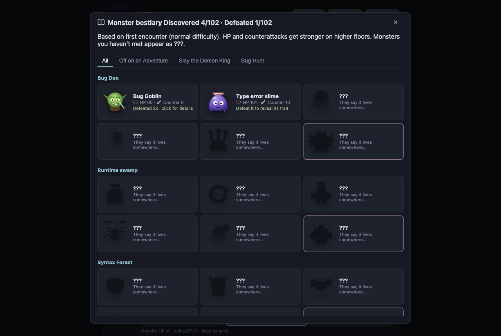

Every monster you've met: art, HP, counterattack, boss rule, phase-2 awakening and kills, filterable by chapter (area). **📖 Bestiary** at the top right of the start screen.

### Ranking
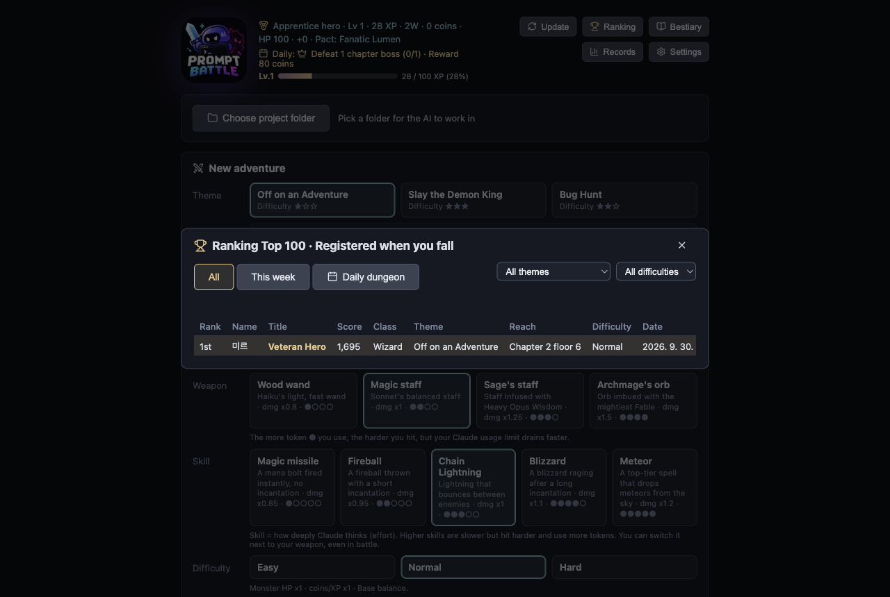

**All-time · This week · 📅 Daily** tabs with theme and difficulty filters, showing the chapter/floor reached, titles and rebirth stars. **🏆 Ranking** at the top right of the start screen.

### Prologue
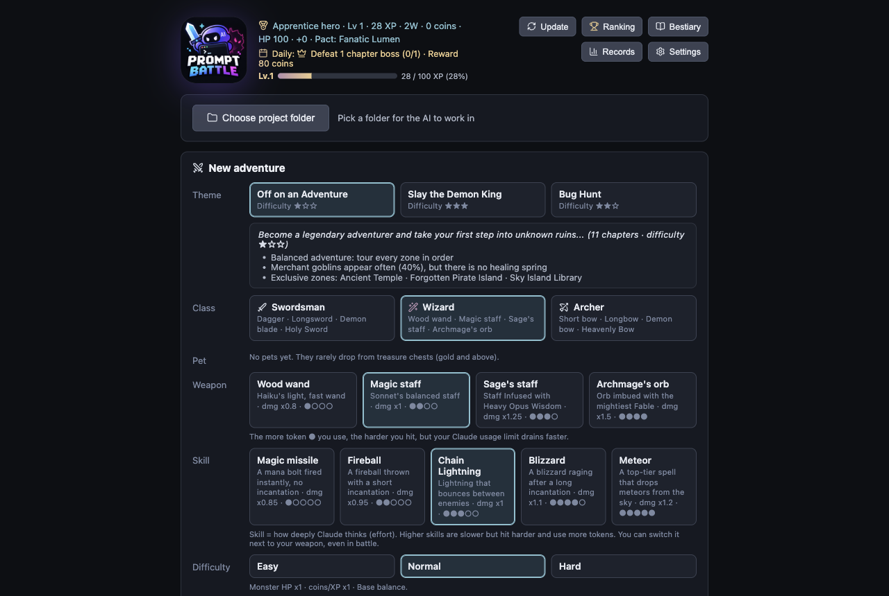

A new adventure (or the daily dungeon) opens with the theme's story, one line at a time. Clearing a chapter shows the next story card; bosses speak when they appear and when they awaken.

### 2. Battle
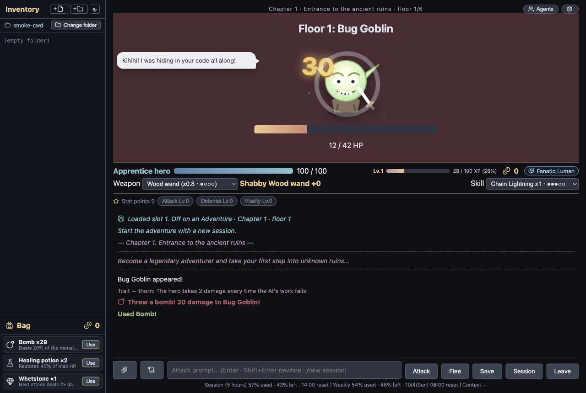

- **Top left, inventory**: the project's file tree — drag to move, drop files from Finder, `+📄` `+📁` to create, click to view/edit (⌘S saves; closing with unsaved edits asks first).
- **Bottom left, 🎒 bag**: bandages, potions, whetstones, amulets, smoke bombs — `사용` (use) is a free action.
- **Middle**: the monster and its HP, your HP, weapon (model) and **class skill** switchers, ⭐ stat points (+1 per monster defeated).
- **Log**: your bubbles (right), the AI's replies (left — typed live, markdown, important parts colored), and the commands/edits/reads it runs as separate **tool cards** (IN/OUT, done/failed).
- **Bottom**: a multi-line input (Enter attacks, Shift+Enter newline), `공격` attack · `도망` flee (50%) · `저장` save · `세션` switch session · `나가기` exit, and a small usage line (5-hour/weekly plan limits, context tokens).

### 3. While the AI works: party + typing drills
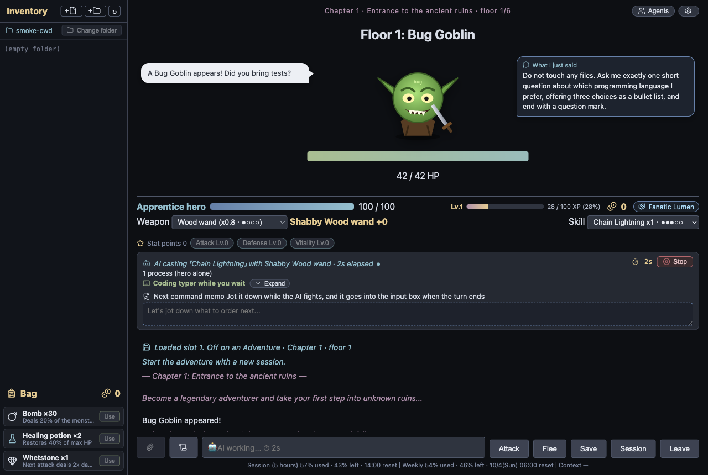

A live timer, the **AI party** (🧙 wizard explores · 🗡 swordsman implements · 🏹 archer verifies) with how many processes run at once, and how many background tasks are pending. Long jobs go to the 🦅 **courier** subagent in the background, and Claude follows up with the result when it's done. Meanwhile, **type a line of code** exactly for 1 damage plus an explanation of that code (tap for more).

The **👥 agents** tab (top right) lists the last 10 subagents: how long running ones have been going, how long finished ones ran, and on click their job, actions (✓/✗) and final report.

### 4. Quests (when the AI asks you something)
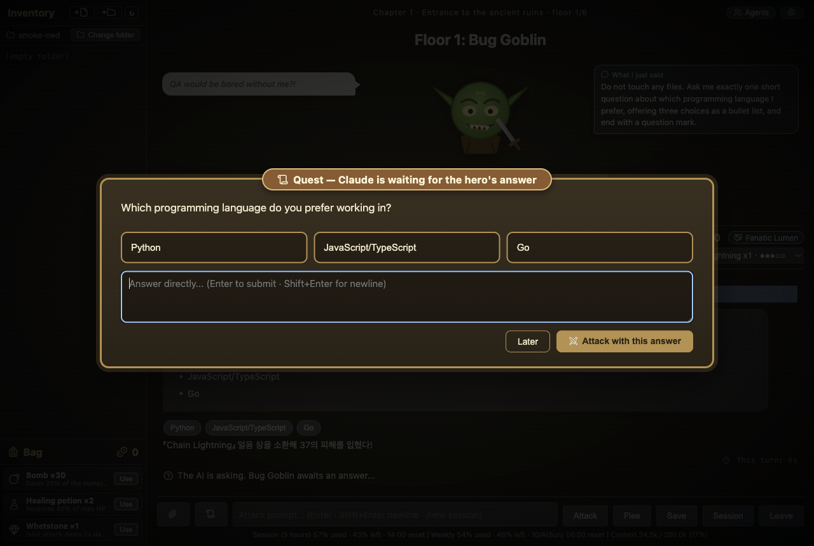

When the AI needs your answer, a large quest window opens. Pick a choice or write your own, and **attack with that answer**. When Claude asks a **multiple-choice question** mid-turn (Claude Code's question prompt), each question gets option cards (one pick = radio, several = checkboxes) and a free-answer box; your picks go straight back to Claude and the turn carries on. The answered questions stay in the log as a card with your picks lit up. Keys work too: 1–9 to pick (a single-choice question moves on to the next), Enter to go; Ctrl/⌘+Enter approves a war-council plan. Need to check a file first? **👁 Look away** puts the window aside — the question keeps waiting with your picks — and the button at the bottom brings it back (the war council and safe mode windows too).

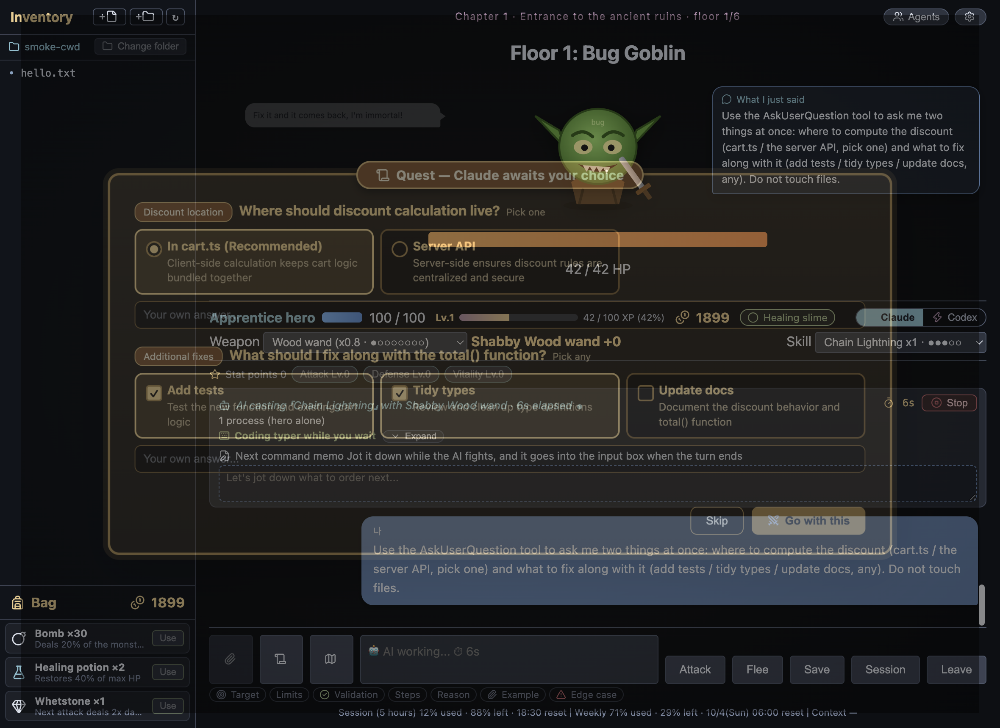

**🗺 War council**: turn on 🗺 next to the input and Claude plans first, shown in the quest window. **Approve and go** and it starts right away in the same turn; write what to change and **request changes** and it comes back with a revised plan (Claude only).

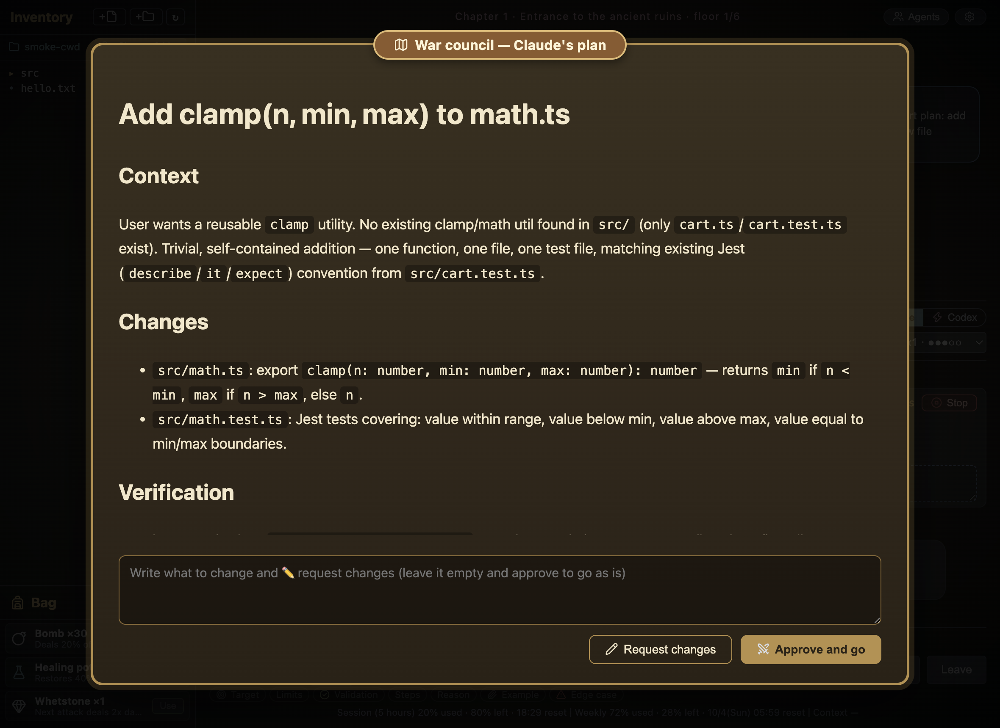

**🛡 Safe mode** (⚙️ Settings → Claude, only when on): risky commands — `rm -rf`, force pushes, `git reset --hard`, dropping databases, `sudo` — stop right before they run and ask you to allow or block them.

### 5. Merchant goblin
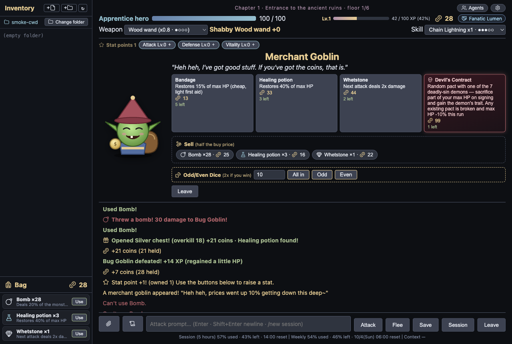

Appears after 35% of clears (40% in the adventure theme). Four goods sit side by side, rotating each visit, each with a per-visit limit (shown as "left"), priced higher the deeper you go (+10% a floor). 10% of the time a contract is shelved, and a **devil's contract** first poses as a plain one, then corrupts a second later. Sell bag items back (half today's price) or gamble on 🎲 odd/even (win double; `올인` = all-in). Typing a prompt here closes the shop and attacks the next monster.

### 🏮 Night market
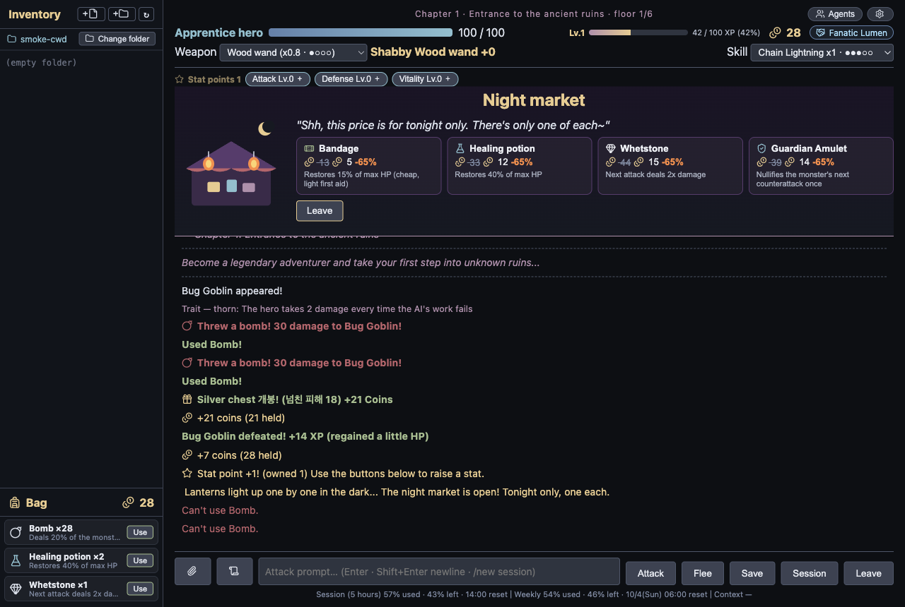

10% of clears: 4 goods, boss relics and contracts included, 30–70% off, one of each.

### Shrine & spring
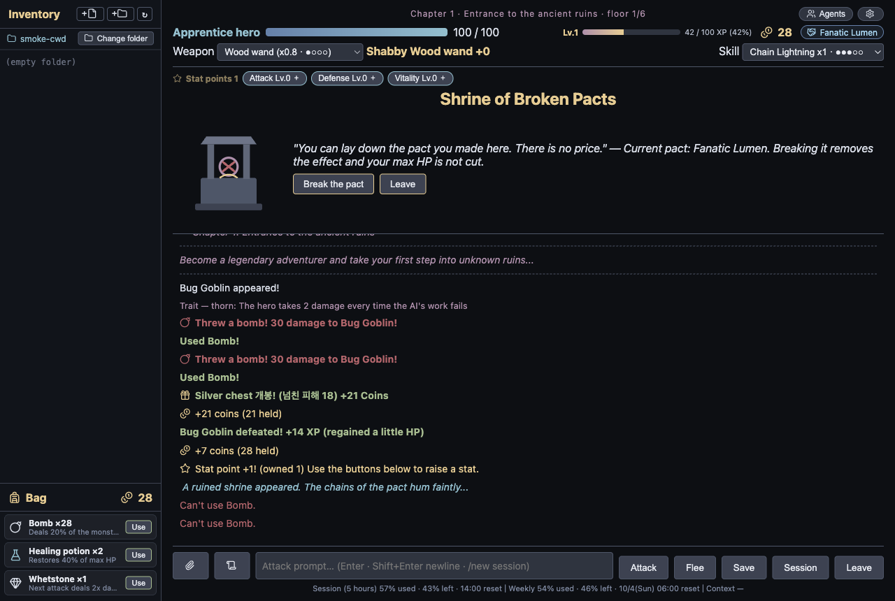
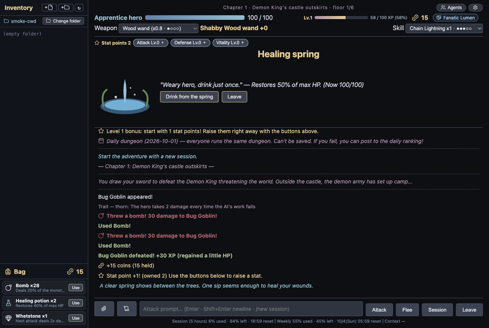

While bound, a shrine appears 10% of the time to renounce your pact with no max-HP penalty. The healing spring (5%, not in the adventure theme) restores 50% of max HP once.

### 📜 Skillbook
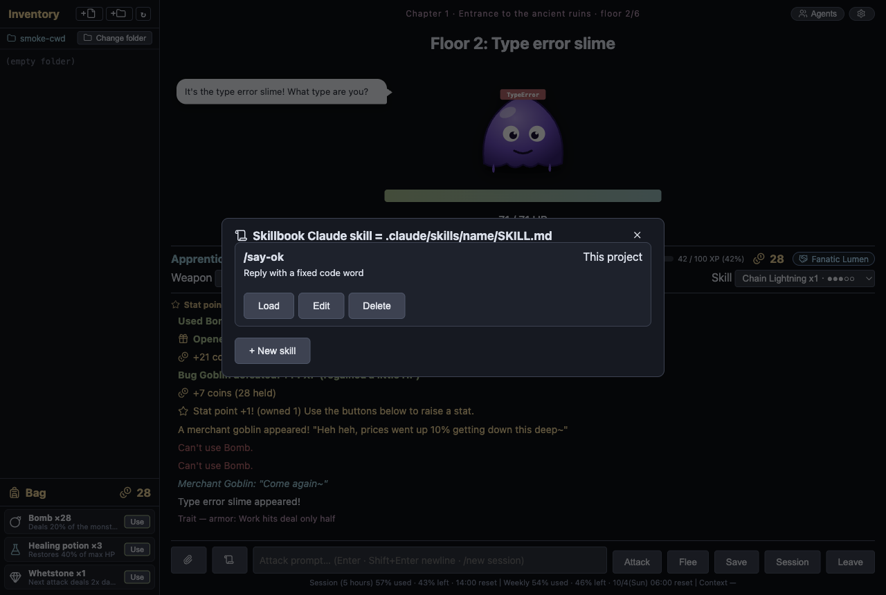

📜 by the input. Write frequent instructions as Claude skill files (`.claude/skills/<name>/SKILL.md`); **Load** puts `/<name>` in front of the prompt and Claude runs it.

### 6. Blacksmith
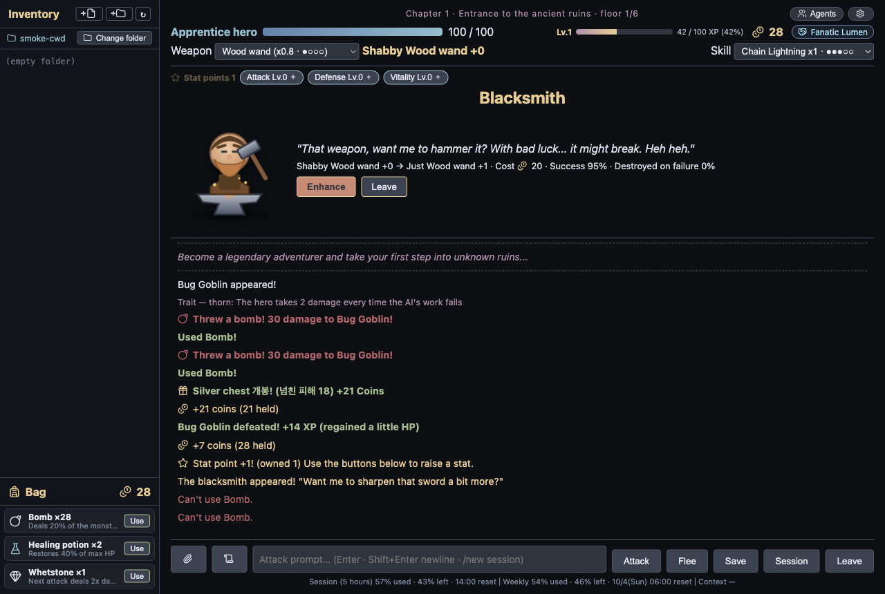

Enhance your weapon with coins (up to +10). Success gets less likely as it climbs, and from +3 a failure can break it back to +0 (shabby). Each level changes the weapon's prefix (초라한 shabby → 그냥 plain → … → 신화의 mythic).

### When you fall
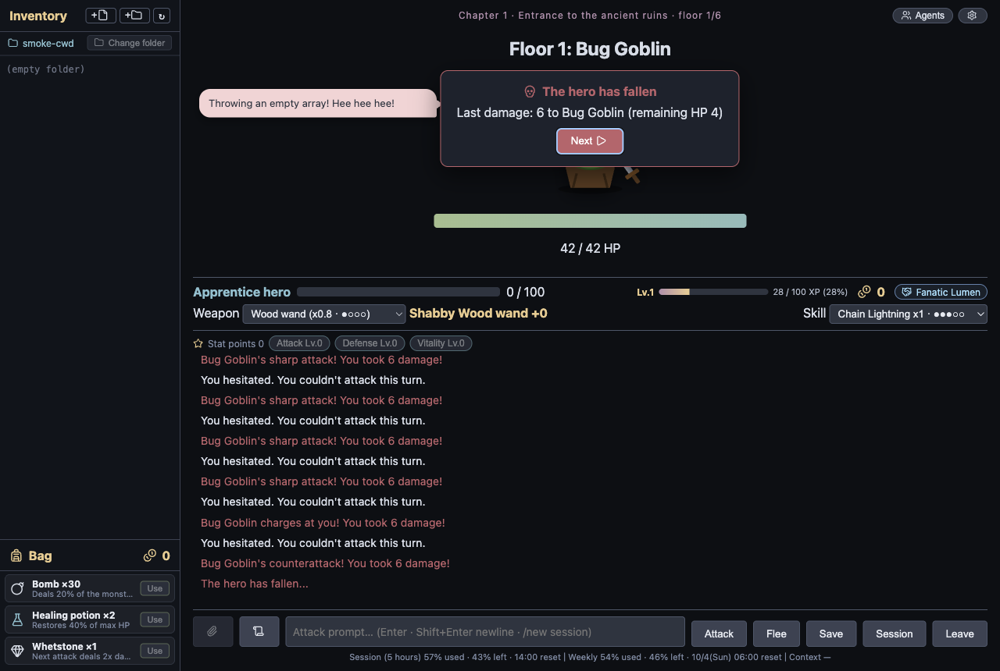

The killing blow (who, how much, the HP you had) stays on screen until **Next ▶** opens the summary (and the ranking).

### 7. Exit
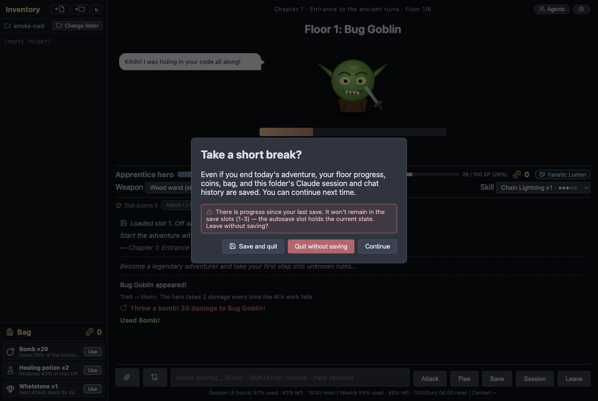

"End today's adventure" or "keep playing". Ending saves your floor, coins, bag, weapon level, and this folder's Claude session and chat history. Each session also autosaves the game state, so resuming a session resumes the run.

## Desktop App (Mac · Linux · Windows)

Grab the file for your OS from [GitHub Releases](https://github.com/tpgusgh/prompt-engineering-is-game/releases): `.dmg` for Mac (Apple Silicon `mac-arm64` / Intel `mac-x64`), `.AppImage` for Linux (x64 / arm64; `chmod +x`, then run), the installer `.exe` for Windows x64. The **Update** button at the top right of the start screen checks for a new version. To build it yourself:

```bash
git clone https://github.com/tpgusgh/prompt-engineering-is-game.git
cd prompt-engineering-is-game
npm install
npm run electron:build
```

On a Mac this produces a `.dmg` under `release/` (Linux/Windows: `npx electron-builder --linux` / `--win`). Open it and drag Prompt Battle into Applications, or run the built `.app` directly.

**First launch:** macOS may say the app "cannot be opened because the developer cannot be verified" — it isn't notarized (that needs a paid Apple Developer account). Right-click the app → Open, then confirm. Only needed once. (If your machine has an Apple Development signing identity, `electron-builder` uses it automatically and you may see no warning.) Mac builds are Apple Silicon (arm64) only for now.

**Windows:** the installer isn't signed, so SmartScreen may show "Windows protected your PC" — More info → Run anyway. **Linux:** AppImages may need FUSE (`libfuse2`).

## CLI

```bash
npm install
npm link
promptbattle --difficulty normal
```

Run it inside the project you want to work on. Type `/quit` to leave, `/flee` to try escaping (50%), `/new <prompt>` to start a fresh session, `/use <item>` to use an item, and `/buy <item>`, `/bet odd|even <coins>`, `/leave` at the merchant, `/enhance` at the blacksmith, and `/stat attack|defense|vitality`, `/save 1-3`, `/session <id>` any time. Requires Node.js >= 22.18.0 (native TypeScript execution, no build step). A published `npm install -g` copy won't work — Node refuses to type-strip `.ts` under `node_modules` — so use `npm link` from a clone.

## Versions / releases

Versions are published as [GitHub Releases](https://github.com/tpgusgh/prompt-engineering-is-game/releases), each with the Mac `.dmg`, Linux `.AppImage` and Windows `.exe` attached, so you can install without building. Changes are listed in [CHANGELOG.md](CHANGELOG.md).

Cutting a release (maintainers):
```bash
npm version minor        # bump package.json and create the vX.Y.Z tag
npm run release          # test → push the tag → GitHub Actions builds Mac/Linux/Windows into the release
```

## Setup

No API key needed: the game reuses the Claude Code login already on your machine (e.g. a Claude subscription). Prefer an API key? Set `ANTHROPIC_API_KEY` and the SDK uses that instead. Note that an app launched from Finder doesn't inherit shell environment variables, so the Claude Code login is the reliable path for the Mac app.

## Safety

The agent runs with full autonomous file/command permissions (no per-action confirmation), like `claude --dangerously-skip-permissions`. Only point it at projects you trust. Tool access is limited to Read/Write/Edit/Bash/Glob/Grep. Each run is one continuing Claude Code session, so context and cost grow across floors like a long `claude` session.

## Limitations

- Ctrl+C in the CLI ends the run and saves like `/quit`, but a turn already in flight finishes first (with full permissions).
- No npm registry publish yet — install from the repo.
