<p align="center">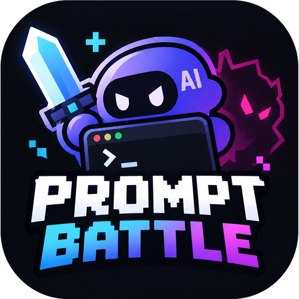</p>

# プロンプトバトル

[한국어](README.md) | [English](README.en.md) | **日本語**

実際のAIコーディングをターン制RPGで包んだゲームです。入力したプロンプトがそのまま攻撃になります。長く具体的なほど強く殴れます。そしてゲーム内でAIが Claude Agent SDK を通じて、あなたのプロジェクトのファイルを実際に読み、直し、コマンドを実行します。

## 機能

- **プロンプト = 攻撃** — 良いプロンプトほど強い。基本ダメージは長さ(10 + 8文字ごとに1、最大40)、そこに **良いプロンプトの基準7つ** をひとつ満たすごとに **+50%**、3つ以上で **クリティカル ×1.5**(最大270): 🎯 対象(ファイル・関数・`コード`を指す — `src/app.ts`、`login()`) · 🧱 制約(必ず・〜せずに・〜なしで・維持) · ✅ 検証(テスト・確認して・通る) · 🪜 手順(段階的に・順番に・まず〜次に・1. 2. のリスト) · 🧐 理由(なぜ・〜ので・〜するため) · 📎 例(例・例えば) · ⚠️ エッジケース(例外・境界値・空の値・null)。満たした基準は入力欄の下に入力しながら点灯し、武器・強化・砥石まで含めた **予想ダメージ** もすぐ表示されます。50文字未満は基準が半分しか認められず、クリティカルもありません(キーワードの羅列防止)。韓国語/英語の両方を認識します。

  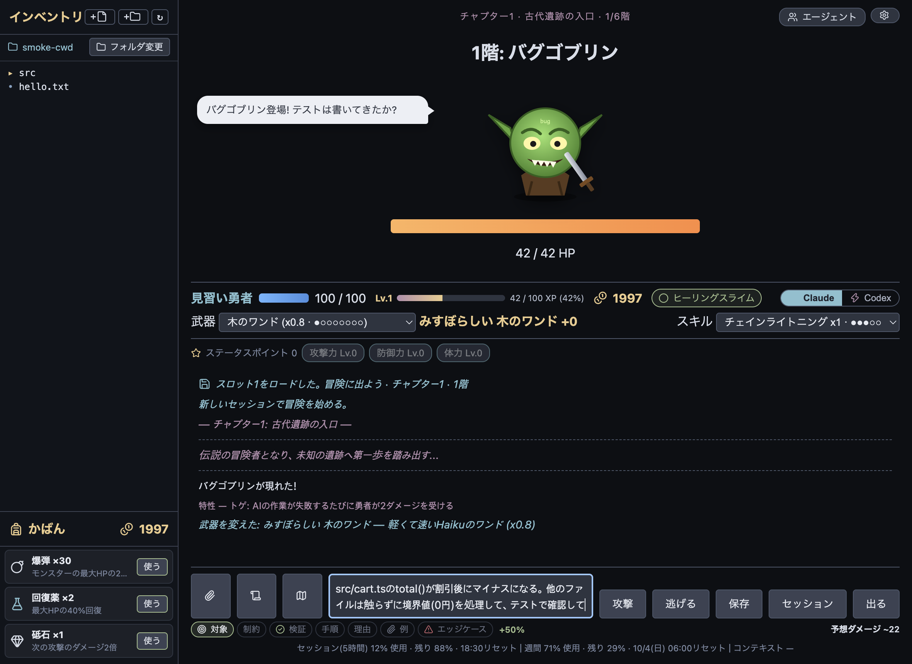
- **リアルタイムヒット (働いた分だけ)** — AIがコマンドを実行したりファイルを直したりする作業が成功するたびに、その瞬間ヒット(プロンプトダメージの25%、1〜12)が入り、ターンが終わるとプロンプトダメージ全体がとどめの一撃になります。失敗した作業はヒットなし。作業中は **⏹ 止める** でターンをすぐ止められ、モンスターの右側には **自分が今言ったこと** が表示されます。触ったファイルは本物のファイルアイコンがモンスターに飛んでいきます。
- **経験値バー・レベル報酬・称号** — 次のレベルまで何%溜まったかを体力バーのように表示(100 XPごとにレベルアップ)。新しいプレイは **勇者のレベル分のステータスポイント** をもらって始まり、レベルに応じて称号が変わります(見習い勇者 → 駆け出し冒険者 → … → 伝説のプロンプター → AIパーティーの王)。戦闘中にモンスターを倒すとすぐ溜まり、レベルアップの通知が出ます。
- **テーマ3つ、全部違う** — テーマを押すと特徴と難易度が見えます。
  - 冒険に出よう (難易度 ★☆☆): すべてのエリアを順番に、商人・鍛冶屋が1.5倍、専用エリアは古代神殿・忘れられた海賊島・天空島の図書館
  - 魔王を倒しに (★★★): 最初のチャプターから魔王軍、ボスHP +30%、コイン・経験値1.5倍、専用エリアは魔王軍・魔王軍精鋭・魔界サーバールーム
  - バグ掃討戦 (★★☆): テスト通過ターンのとどめ +25%、作業失敗ターンの反撃 +20%、専用エリアは虫の巣穴・コンパイル火山・テスト沼
  - テーマごとにチャプター10〜11個の物語があり、難易度(かんたん・ふつう・むずかしい)はモンスターHP x0.7 / x1 / x1.4、コイン・経験値 x0.7 / x1 / x1.5。
- **モンスター102種・図鑑** — チャプターごとにモンスター6種(最後はボス)。共通エリア8個 + テーマ専用エリア9個: バグゴブリン、SQLインジェクション・ヴァンパイア、浮動小数点の幽霊、魔王ルートキット、ハイゼンバグの蛾、N+1クエリのタコ、フォースプッシュ船長、node_modules ブラックホール、本番でだけ爆発するバグ神など。図鑑は全体(エリア別) / テーマ別(チャプター順)のフィルタ付き。**📖 図鑑** では出会ったモンスターの絵・HP・反撃ダメージ・ボスルール・撃破回数が見られ、出会っていないモンスターはシルエットで表示され、倒したモンスターは押すと特性・性格・セリフが見られます。モンスターにはそれぞれ **特性** がひとつあります: 鎧(作業ヒット半減)、再生(ターンごとに回復)、凶暴(反撃 +30%)、トゲ(作業が失敗すると勇者がダメージ)、脆弱(とどめ +25%)、キーワード弱点(クリティカル +30%)、テスト弱点(テスト通過ターン1.5倍)。
- **📅 今日の挑戦** — 1日1回、みんな同じダンジョン: 日付でテーマ・チャプターごとに出るエリアや商人/宝箱/逃走の確率が決まります。難易度はふつう、1階から、セーブ不可。倒れると **今日の挑戦ランキング** に登録できます(ストーリーの進行度はそのまま)。
- **🌟 転生** — レベル20から、スタート画面の **転生する** でレベル1に戻る代わりに転生 ★ を獲得します。★ごとにダメージ・コイン +10%、初期ステータスポイント +2(永久、累積)。コイン・武器強化・仲間・図鑑はそのままです。
- **🐾 仲間** — 金以上の宝箱から低確率(3〜20%)で出ます。一度手に入れれば永久、スタート画面で1匹を選んで連れて行きます: ヒーリングスライム(毎ターン最大HPの5%回復) · ベビードラゴン(毎ターンモンスター最大HPの3%の炎) · 知恵のフクロウ(階の経験値 +20%)。
- **🏮 夜市** — 階をクリアした後、10%の確率で開きます。ボスの遺物や契約書まで混ざった商品4つがその日の値段の30〜70%引き、ひとつずつだけ。
- **休憩所** — 階の合間にときどき **癒しの泉**(5%、最大HPの50%を一度だけ回復 · 冒険に出よう テーマにはなし)と、契約があるとき **契約破棄の祭壇**(10%、最大HPを失わずに契約を手放せる)が現れます。階をクリアした後の確率: 商人35%(冒険は40%) · 鍛冶屋30% · 夜市10% · 泉5% · 祭壇10% · 何もなし10〜20%。
- **物語・演出** — 新しい冒険を始めるとテーマ別のプロローグカード、ボスは登場・覚醒のセリフ、チャプターをクリアすると物語カード。ダメージ数字が跳ね上がり、クリティカル・宝箱・階クリア・レベルアップ・覚醒のたびにきらめきと閃光。
- **📜 スキルブック** — 入力欄の横の📜。よく使う指示を **Claude スキルファイル**(`.claude/skills/名前/SKILL.md`)として作成・編集・削除します。**呼び出す** を押すと入力欄の先頭に `/名前` が入り、そのまま攻撃すると Claude がそのスキルを実行します。`~/.claude/skills` の自分のスキルも一覧に表示されます(呼び出しのみ)。
- **ボスルール・2段階覚醒** — ボスはHPが半分を下回ると一度 **覚醒** します。エリアごとに異なります: 激怒(反撃 +30%) · 再生(毎ターン最大HPの4%回復) · 鋼の肌(受けるダメージ -25%) · 狂暴化(反撃2回、60%ずつ) · 吸血(反撃で与えた分だけ回復)。図鑑でボスごとに確認できます。ボスは30%の確率で **固有の遺物**(17種: 次の攻撃2.5〜4倍 · 反撃2〜3回無効 · HP回復 · モンスターHP%ダメージ · 経験値 · コイン)を落とします。チャプターボスごとに特殊ルールもあります: ツールが失敗すると回復 / テストが通らないとダメージなし / 1ターンにファイル3つ以上を修正しないとダメージなし / 120文字以下の短い命令でないとダメージなし。
- **実績・今日のクエスト・記録** — 初ボス撃破、クリティカル10回、武器+5、図鑑コンプリート、契約破壊者(契約を強制破棄)、契約にやられた者、タイピングの神(700打)、お金持ち(コイン3000)、総買いの客(商人の品を全部購入)、夜市の常連、AI二股(1回のプレイでClaude・Codex両方)など実績27個(達成するとコイン)。毎日変わるクエスト(「テストを3回通す」など)。**📊 記録** では処理したトークン、最高の一撃、最長ターン、武器(モデル)別の勝率が確認できます。
- **宝箱** — AIの作業の途中でモンスターのHPが0になると、その場で倒れて宝箱に変わります。残りの作業・とどめの一撃・コーディングタイピングは宝箱に積み上がり、あふれたダメージ分だけランクが上がります: モンスター最大HPに対するあふれた割合で8ランク: 木(0%) · 鉄(15%) · 銀(35%) · 金(70%) · 白金(120%) · ダイヤ(200%) · 伝説(300%) · 神話(500%+)。コインは常に、アイテムは確率(木5%〜神話95%)で — 良い宝箱ほど良いアイテム。
- **作業完了通知** — ゲームウィンドウが後ろにあるときにAIが作業を終えると通知(押すとゲームへ)、Macは Dock のバウンド・Windowsはタスクバーの点滅。⚙️ 設定 → サウンド・通知でオン/オフを切り替えます。
- **ショップとアイテム** — 商人は一度に4つだけ並べ、訪れるたびにラインナップが入れ替わります。値段は深く進むほど上がります(階ごとに +10%、10階なら2倍)。かばんのアイテムは買った値段の半額で売ることもできます。包帯・回復薬・砥石・お守り・煙玉・生命の結晶のほか、エリクサー(完全回復)、爆弾(モンスター最大HPの20%ダメージ、ボスは5%、最小30)、知恵の巻物(経験値 +30)、**コインのお守り**(獲得コイン永久 +25%、一度だけ購入可)、**契約書**、**悪魔の契約書**。
- **契約** — 契約書は6元素神のうちひとつとランダムな契約を結びます(すべてのヒット +5% + 神の特性: 火 クリ +30% · 水 ターンごとに最大HP 3%回復 · 風 逃走75%・作業ヒット +15% · 土 反撃 -15% · 雷 作業ヒット +30% · 光 クリア回復2倍・ボス +20%)。悪魔の契約書は七大悪魔のうちひとりと契約し、署名に最大HPの10〜30%を捧げます(傲慢 とどめ +40% · 強欲 コイン +50% · 憤怒 瀕死時ダメージ +60% · 嫉妬 反撃を30%反射 · 色欲 タイピングダメージ3倍 · 暴食 クリア時に最大HP 20%を追加回復 · 怠惰 作業ヒットの代わりにとどめ2倍)。契約はひとつだけ — 契約があるのにまた契約書を使うとすべての契約が破れ、**そのプレイの間は最大HPが10%減ります**。契約はそのプレイの間だけ有効です — 新しいプレイは契約なし、バッグも空で始まります(セーブを読み込むとそのプレイの契約・バッグ)。商人にはまれに(訪問ごとに10%)契約書か悪魔の契約書がひとつ並びます。
- **ファイル・写真の添付** — 入力欄の横の📎、入力欄へのドラッグ&ドロップ、画像の貼り付け(⌘/Ctrl+V)。写真は Claude が直接見て、PDFはドキュメントとして、コード・テキストファイルは内容ごと送ります(一度に5個、画像5MB · PDF 30MB · テキスト200KB)。
- **次のコマンドメモ** — AIが戦っている間に、作業パネルの📝メモに次のプロンプトを書いておくと、ターン終了時に入力欄へ入れてくれます。
- **ゲーム中にフォルダを変更** — インベントリの上の **📁 フォルダ変更** で作業フォルダを変えるとファイル一覧が切り替わり、Claude はそのフォルダで新しいセッションとして続けます(AIが作業中は不可)。
- **👑 称号ショップ** — スタート画面の **👑 称号**。実績や冒険で稼いだコインで称号21個(カフェイン中毒者 200 〜 金で買った称号 10000)を買います(一度買えば永久)。つけた称号はランキングとプロフィールでレベル称号の代わりに表示されます。等級(一般・レア・英雄・伝説)ごとにランキングでの色が違い、一部の称号(竜を倒した者、キーボードの神、モンスター博士など)は実績を達成すると買えます。

  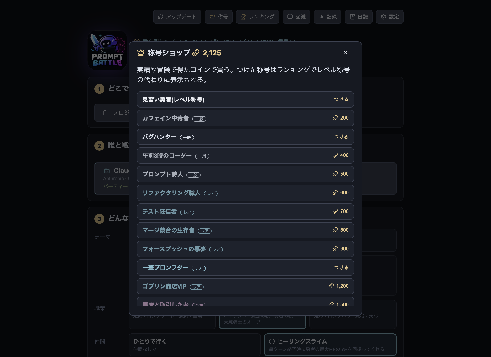
- **オンラインランキング** — 倒れると結果画面で名前を入力してランキングに登録します(スコア = (到達階×100 + クリアしたチャプター×400 + 経験値) × 難易度倍率)。プレイごとに上位100人だけが残る **全体 · 今週 · 今日の挑戦** タブがあり、テーマ・難易度で絞り込めます。称号(称号ショップで買った称号をつけていればそれ)と転生 ★ も表示され、行をクリックすると記録の詳細ウィンドウが開きます。スタート画面の **🏆 ランキング** で見られます。登録はリリース版のアプリだけで可能です — 署名キーはビルド時にのみ入り、サーバーがプレイごとに発行した1回限りのトークンとスコアの再計算で検証します。サーバー(Vercel)は [`server/`](server/README.md)。
- **疲労度** — Claude の使用量(5時間・週間のうち高いほう)が75%を超えると「疲労度 高」、90%を超えると赤い **疲労度 危険** バッジと警告が出ます(まもなくAIが止まるかもしれません)。
- **結果画面** — 冒険が終わると、撃破数、経験値、コイン、最高の一撃、テスト通過、最長ターンなどをカードにまとめて表示します。
- **モンスターの吹き出し** — モンスターが吹き出しでしゃべります: じっとしているときは言葉が変わり続け、殴られたとき・殴るとき・死ぬときなど場面ごとにモンスター別のセリフがあります。商人と鍛冶屋も話しかけてきます。
- **プレイヤーHP** — ターンが終わっても生き残ったモンスターは反撃します(ためらったり攻撃が失敗するとより痛く)。ただしAIが返答の最後でこちらに質問したときは、モンスターは答えを待ちます。HPが0で敗北。階をクリアすると体力が回復します。
- **職業スキル = effort** — Claude がどれだけ深く考えるか(effort)を職業スキルで選びます。上位のスキルほど遅いけれど強く(x0.85 〜 x1.2)、トークンをより多く使います。スタート画面では武器の下、戦闘中は武器の横で変更できます。
  - 剣士: 速斬り → 連続斬り → 回転斬り → 剣気の嵐 → 天剣
  - 魔法使い: マジックミサイル → ファイアボール → チェインライトニング → ブリザード → メテオ
  - 弓使い: 速射 → 貫通矢 → 連射 → 矢の雨 → 天空の矢
- **職業と武器 = Claude モデル** — スタート画面で職業(🗡 剣士 / 🧙 魔法使い / 🏹 弓使い)を選ぶと、モデルごとに武器名と攻撃演出が変わります。良いモデルほど強い武器(x0.8 〜 x1.5)、戦闘中も交換可能です。

  | モデル | 🗡 剣士 | 🧙 魔法使い | 🏹 弓使い |
  |---|---|---|---|
  | Haiku (x0.8) | ダガー | 木のワンド | ショートボウ |
  | Sonnet (x1) | ロングソード | 魔法の杖 | ロングボウ |
  | Opus (x1.25) | 魔剣 | 賢者の杖 | 魔弓 |
  | Fable (x1.5) | 聖剣 | 大魔導士のオーブ | 天弓 |

  強化するたびに武器名の前の修飾語が変わります: みすぼらしい → ふつうの → まあまあの → なかなか良い → (職業別: 頑丈な・鋭い / 魔力が流れる・魔力が宿る / ピンと張った・風を切る) → 輝く → (澄んだ / 星明かりの宿る / 鷹の目が宿る) → 燦然たる → 伝説の → 神話の。例: `みすぼらしい魔法の杖 +0` → `ふつうの魔法の杖 +1`。
- **ストーリーテーマとチャプター** — 冒険に出よう / 魔王を倒しに / バグ掃討戦。6階ごとにチャプターボスが登場し、倒すと次の物語が続きます。進行状況が保存されるので、次に起動したときに続きから遊べます。
- **インベントリ** — サイドバーにプロジェクトのファイルツリーが表示され、ファイルを開いて見たり、直接編集して保存したりできます。ファイル/フォルダを **ドラッグして別のフォルダへ移動** し、Finder などの **外部ファイルをドラッグ&ドロップするとコピー** して取り込みます(同名がある場合は `名前 (1)` に)。`+📄` `+📁` ボタンで選択したフォルダの中に新しいファイル/フォルダを作ります。すべての操作はプロジェクトフォルダ内に制限され、上書きはしません。↻ 更新はアニメーションとともにツリーを再読み込みします。
- **AIパーティー (サブエージェント)** — 🧙 魔法使い(探索・調査)、🗡 剣士(実装)、🏹 弓使い(テスト・検証)の3人の Claude サブエージェント。AIが作業を分けて複数人を **同時に** 送り出すと、「プロセスN個を同時進行」とそれぞれの仕事が表示されます。魔法使いが動くと精霊が、弓使いが動くと仲間たちが、剣士が動くと弓使いの援護の中で剣士が攻撃します。⚙️ 設定 → AIパーティーで **パーティーモード** をオン/オフできます(トークンをより多く使うため、ゲーム中も可能)。
- **ターンタイマー & 待っている間のコーディングタイピング** — AIが何秒/何分作業しているかをステータス行と入力欄にリアルタイムで表示します。待っている間に JavaScript・Python・Go・Rust・SQL・Git・Docker など20以上の言語/ツールのコード1行(80種以上、ランダム)をそのままタイプするとモンスターに1ダメージ、そのコードが何かを3秒間説明が表示され(押すと詳しく見られます)、次のコードへ進みます。タイプ数/正確さを表示。タイピング領域の **⚙️ 言語** ボタンで C・C++・Python など好きな言語だけを選んで練習できます。
- **BGM & 効果音** — Suno で作った曲8つ: タイトル、テーマ別の戦闘曲(冒険に出よう / 魔王 / バグ掃討戦)、ボス、商人のショップ、鍛冶場、クエスト(AIが質問するとき)。ループ再生で、場面が変わるとクロスフェード。ヒット・クリティカル・被弾・コイン・強化の成功/失敗/破壊・タイピング音などの短い効果音は自前で合成しています。🔊 ボタンと音量スライダーで調整できます。
- **🤖 Claude · ⚡ Codex** — 一緒に戦うAIを選ぶ(スタート画面の②、戦闘中は武器の隣のスイッチ)。武器はどちらも同じ4段階: Claude Haiku·Sonnet·Opus·Fable / Codex Luna·Terra·Sol·Astra(バージョンなしで各系列の最新モデル)、スキルは同じeffort。切り替えると各AIは自分のセッションを続け、その間にもう一方と話した内容を引き継ぐ(ファイルは同じフォルダ)。Codexは最初に一度ChatGPTでログイン。
- **⚙️ 装備枠** — ボスの遺物を消費せずに装備枠(2つ)に付けると永続効果: ダメージ +10% · 受ける反撃 -10% · 毎ターンHP 2%回復 · 作業ヒット +15% · 経験値 +10% · コイン +10%(遺物の種類による)。かばんの**装備**、バッジをクリックで外す。
- **📓 冒険日誌** — プロジェクトフォルダごとに日付別でAIがしたこと: ターン、撃破、合格したテスト、トークン、変更したファイル、送った命令。スタート画面の**📓 日誌**か <kbd>Ctrl/⌘</kbd>+<kbd>J</kbd>。
- **⌨️ ショートカット** — <kbd>1</kbd>〜<kbd>9</kbd> かばんのアイテム、<kbd>Esc</kbd> 窓を閉じる・AIを止める、<kbd>Ctrl/⌘</kbd>+<kbd>K</kbd> スキルブック、<kbd>?</kbd> ヘルプ。
- **🎓 チュートリアル** — 初回起動でスタート画面と最初の戦闘を1ステップずつ案内。設定 → 👁 表示 からもう一度見られる。
- **👁 表示(アクセシビリティ)** — 大きい文字、色覚サポート(赤・緑の代わりにオレンジ・青)、演出を減らす(揺れ・きらめき・閃光オフ)。
- **🌐 言語** — 한국어 · English · 日本語。設定ウィンドウ右上の🌐で選ぶとすぐ切り替わる(初回はPCの言語に従う)。Claudeは書いた言語で答える。ゲーム内の文章は `scripts/i18n-extract.mjs` が集め、`electron/renderer/i18n/<言語>.json` の辞書で翻訳される。
- **⚙️ 設定ウィンドウ** — スタート画面とゲーム内(右上の⚙️)のどこでも同じウィンドウ。Claude タブ: 🔑 接続方式(Claude Code ログインまたは API キー、キーはキーチェーンで暗号化)、🧩 Claude スキルのオン/オフ/選択(検索)、🔌 MCP サーバーごとのオン/オフ。ゲームセッションにのみ適用され、自分の Claude Code 設定は変わりません。そのほか AIパーティー、🔊 サウンド(音量・ミュート)、⌨️ コーディングタイピング言語タブ。
- **時間のかかる仕事は伝令へ** — ビルド・全体テスト・インストール・学習のように時間のかかる作業は 🦅 伝令サブエージェントがバックグラウンドで引き受け、時間制限なしに終わるまで待って、Claude が結果の返答まで続けてくれます。
- **クエストウィンドウ** — AIがユーザーに答えを求めると、画面いっぱいのクエストウィンドウで質問し、選択肢または直接の答えですぐ攻撃します。
- **ゲームかばん** — ファイルインベントリの下の 🎒 かばんで、包帯(最大HP 15%)・回復薬(最大HP 40%)・砥石・お守り・煙玉をターンを消費せずに使えます。
- **ツールカード** — AIが実行したコマンド(Bash)、ファイル修正、読み取りは吹き出しとは区別されたカードで表示されます: IN(コマンド)とOUT(結果)、実行中/完了/失敗の状態、長い結果は折りたたみ/展開。
- **見やすいAIの応答** — AIの返答が **リアルタイムでタイピングされるように** 吹き出しに書かれ、見出し・リスト・コードブロック・表が整ったマークダウンで表示されます。**重要な部分は色で強調**: 太字、成功/通過(緑)、失敗/エラー(赤)、注意/警告(黄)、ファイルパス(青)、コードブロックのシンタックスハイライト。自分のメッセージは右側の吹き出し、送信すると常に一番下へスクロール。入力欄は複数行(Shift+Enter で改行、Enter で攻撃)で、長い文章も全部見えるように伸びます。AIが質問+リストで尋ねると、クリックできる選択肢に変わります。
- **セッション管理** — フォルダを選ぶと、そのフォルダの Claude Code セッション一覧(ターミナルの `claude` で使ったセッションを含む)から、続きのセッションか新しいセッションを選びます。戦闘中も `セッション` ボタンで別のセッションに **差し替え** られ、選んだセッションの会話履歴がログに表示されます。セッションごとにゲーム状態(階・HP・モンスターHP・ステータスなど)が **自動保存** され、セッションを選んで続けるとその状態のまま続きます。コンテキストが80%を超えると、新しいセッションで続けられる `/new ...` プロンプトを表示します。ゲームで使ったセッションは **VS Code の Claude Code セッション一覧や `claude --resume` にも表示されます**(SDK で作ったセッションは本来 VS Code の一覧では非表示になるため、ターンの終了時に自分のコンピューターのセッションファイル `~/.claude/projects/…/<セッションID>.jsonl` の `entrypoint` 表示だけを `cli` に変えます。会話内容はそのままで、使用量の統計は SDK で正常に報告されます)。
- **セーブ / ロード (スロット3つ + オートセーブ)** — 4番目のスロットには常に最新の状態が自動で保存されます(戦っていたモンスターのHP含む)。戦闘中に `セーブ` ボタンで階・HP・コイン・かばん・ステータス・剣の強化・Claude セッションをスロットに保存(ターン消費なし)。スタート画面の `ロード` でスロットを選ぶと、そのフォルダ・テーマ・武器でその階からやり直します(戦っていたモンスターの残りHPも保存されます)。
- **会話履歴** — 自分が打ったプロンプトとAIの返答がフォルダごとに保存され、次にそのフォルダに入ると以前の履歴が先に表示されます。
- **コインと商人ゴブリン** — 階をクリアするとコインを獲得(ボスは3倍)。クリア後にときどき(30%)商人ゴブリンが現れます: 回復薬(最大HP 40%)、砥石(次の攻撃2倍)、守護のお守り(反撃1回無効)、煙玉(逃走100%)、生命の結晶(最大HP +10%、そのプレイの間)。かばんのアイテムはターンを消費せずに使えます。商人の前で **丁半ばくち** もできます: コインを賭けて丁/半を選び、サイコロを振って当たれば2倍、外れれば賭けたコインを失います。
- **ステータス成長 (プレイごとにリセット)** — 毎プレイ Lv.0から開始。モンスターを倒すたびにステータスポイントを1つ得て、戦闘中のボタンで攻撃力(レベルごとにダメージ +10%)、防御力(レベルごとに受ける反撃 -5%)、体力(レベルごとに最大HP +10%、累積)のどれかを上げます。ステータスごとに最大 Lv.10。プレイが終わるとリセットされ、セーブスロットをロードするとそのプレイのステータスが戻ります。(剣の強化だけは永久。生命の結晶もそのプレイのみ)
- **武器強化 (鍛冶屋)** — 階クリア後にときどき(20%)鍛冶屋に会います。コインを払って武器を強化(+1強化ごとにダメージ +10%、最大 +10強)。強化するほど成功確率は下がり(+0→+1: 95% … +9→+10: 14%)、+3強からは失敗すると武器が **折れて +0(みすぼらしい)からやり直し** になることもあります(破壊確率10%〜40%)。
- **使用量表示** — 画面の一番下に小さく、Claude プランのセッション(5時間)上限と週間上限が何%使われ何%残っているか、いつリセットされるか、そして現在の会話セッションのコンテキストトークン(使用/最大)が表示されます。ターンが終わるたびに更新され、クリックで再読み込み。(プラン上限は SDK がパーセントでしか教えてくれないため、トークン数ではなく%で表示。API キー使用時は表示されません。)
- **逃走 / 退出** — 逃走は50%の確率: 成功すると報酬なしで次の階へ、失敗すると1ターンを失って反撃を受けます。ボスからは逃げられません。退出ボタンは「今日の冒険を終える」(進行した階数・コイン・かばん・セッションを保存し、次回その階から再開)と「つづきから」(プレイ続行)から選べます。

## 画面ツアー

### 1. スタート画面
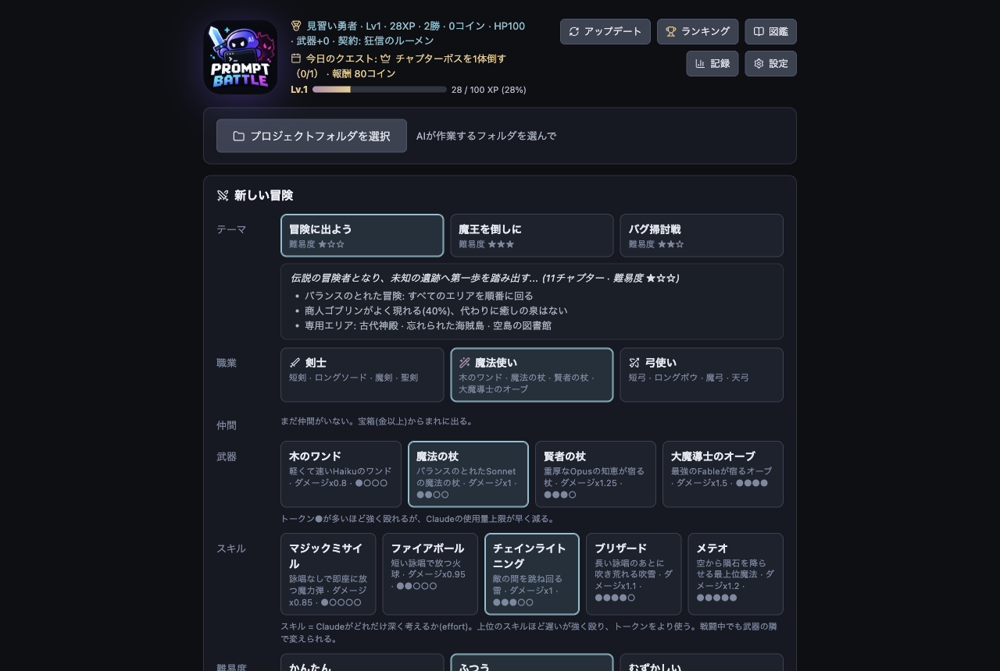

1画面にすべて見えます: 📁 プロジェクトフォルダを選び、**新しい冒険** カードでテーマ、**職業**(🗡 剣士 / 🧙 魔法使い / 🏹 弓使い — 武器名が変わります)、**仲間**(🐾 獲得した仲間のうち1匹)、武器(Claude モデル — **トークン ●** 表示でどれだけ使用量を食うかがわかります)、**スキル**(effort)、難易度を選んで ▶ ダンジョン入場。その下の **📅 今日の挑戦** はみんな同じ1日限りのダンジョンです。レベル20からは **🌟 転生する** ボタンが現れます。下の **つづきから** でセーブスロット3つとオートセーブ(最新の状態、戦っていたモンスターのHP含む)をロードします。フォルダを選ぶとそのフォルダの Claude セッション一覧も表示されます(💾 自動保存された階・HPを表示)。右上の **⚙️ 設定**(ゲーム内でも同じウィンドウ)の Claude タブでは:

- 🔑 **接続方式**: Claude Code ログイン(CLI)または **API キー** (キーチェーンに暗号化して保存、「接続確認」ボタン)
- 🧩 **スキル**: すべてオン / オフ / 選んでオン(検索)
- 🔌 **MCP サーバー**: サーバーごとのオン/オフ、接続状態の表示。**MCP 接続へ** から claude.ai コネクタを開く · MCP サーバー一覧を見る · コマンドや URL で直接追加

ゲームセッションにのみ適用され、自分の Claude Code 設定は変わりません。

### モンスター図鑑
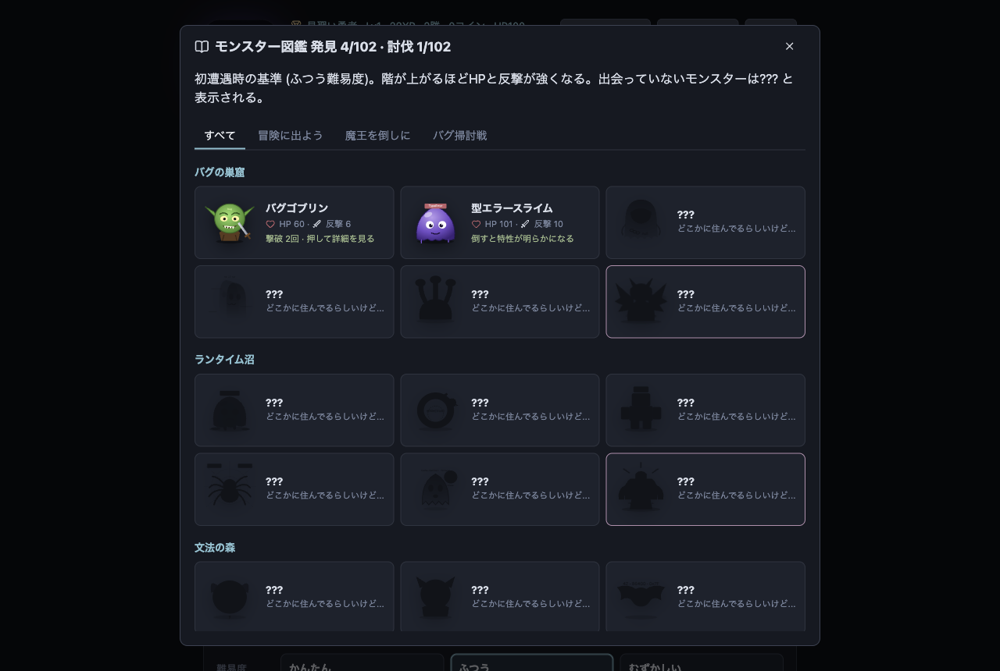

出会ったモンスターの絵・HP・反撃ダメージ・ボスルール・2段階覚醒・撃破回数。チャプター(エリア)別に絞り込めます。スタート画面の右上の **📖 図鑑**。

### ランキング
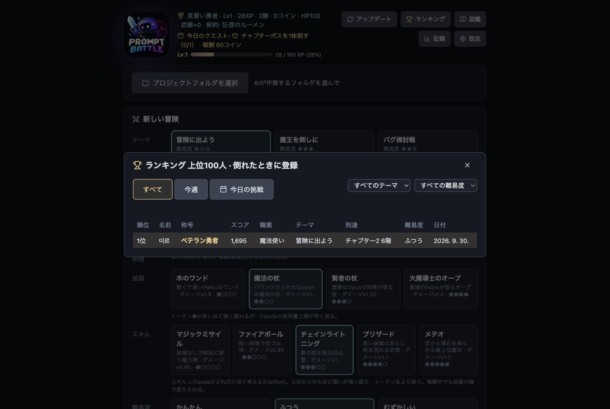

**全体 · 今週 · 📅 今日の挑戦** タブ、テーマ・難易度フィルタ。到達したチャプター・階、称号と転生 ★ まで表示されます。スタート画面の右上の **🏆 ランキング**。

### プロローグ


新しい冒険(または今日の挑戦)を始めると、テーマ別の物語が1行ずつ浮かび上がります。チャプターをクリアすると次の物語カード、ボスは登場・覚醒のときにセリフを言います。

### 2. 戦闘
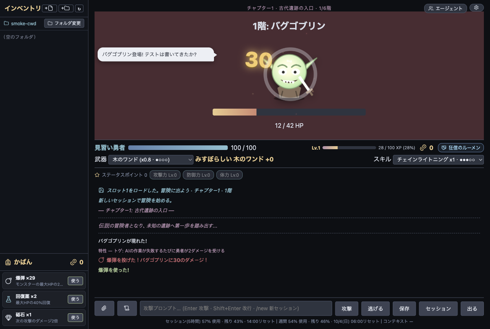

- **左上のインベントリ**: プロジェクトのファイルツリー。ドラッグで移動、Finder からドラッグ&ドロップ、`+📄` `+📁` で新規作成、クリックして表示/編集(⌘S で保存、保存せずに閉じようとすると確認ウィンドウ)。
- **左下の 🎒 かばん**: 包帯・回復薬・砥石・守護のお守り・煙玉。`使う` ボタンでターンを消費せずに使います。
- **中央**: モンスターとHP、勇者のHP、武器(モデル)と **職業スキル** の変更、⭐ ステータスポイント(モンスターを倒すたびに +1)。
- **演出**: 殴るとダメージ数字が跳ね上がり(クリティカルは大きく + 閃光)、宝箱・階クリア・レベルアップ・覚醒のたびにきらめきます。ボスはHPが半分を下回ると **第2形態に覚醒** して赤く光ります。
- **ログ**: 自分の吹き出し(右)、AIの返答の吹き出し(左、リアルタイムタイピング + マークダウン + 重要な部分の色付け)、AIが実行したコマンド・修正・読み取りは **ツールカード**(IN/OUT、完了・失敗の表示)で別に表示されます。
- **下部**: 複数行の入力欄(Enter で攻撃、Shift+Enter で改行)、`攻撃` `逃走`(50%) `セーブ` `セッション`(セッション切り替え) `退出`、一番下に小さくプラン使用量(5時間セッション・週間)とコンテキストトークン。

### 3. AIが働いている間: パーティー + コーディングタイピング
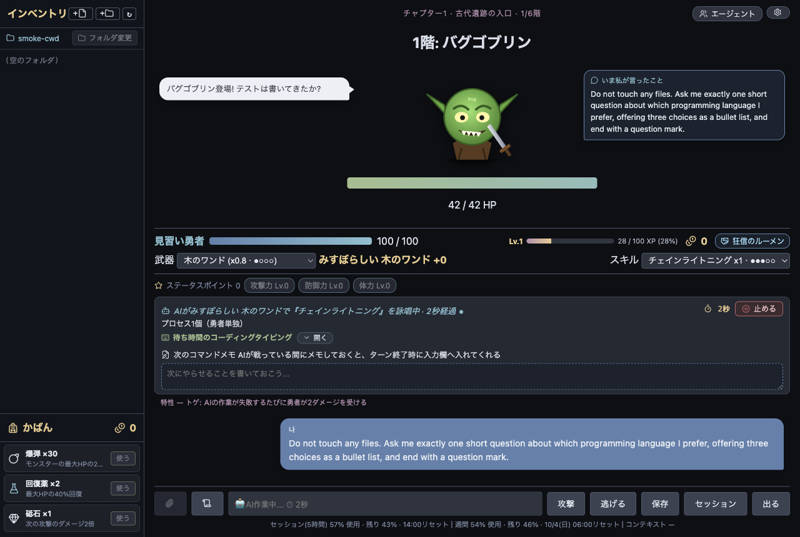

作業時間がリアルタイムで表示され、**AIパーティー**(🧙 魔法使いが探索 · 🗡 剣士が実装 · 🏹 弓使いが検証)が同時にいくつのプロセスで動いているか、バックグラウンド作業がいくつあるかが見えます。時間のかかる仕事は 🦅 **伝令** サブエージェントがバックグラウンドで引き受け、終わると Claude が結果まで続けて答えます。待っている間は **コーディングタイピング**: コード1行をそのままタイプするとモンスターに1ダメージ + そのコードの説明(押すと詳しく)。

右上の **👥 エージェント** タブではサブエージェントの直近10個が見られます: 動いているものは何分経過か、終わったものは何分動いたか、押すと任された仕事・作業リスト(✓/✗)・最終報告まで。

### 4. クエスト (AIが質問するとき)
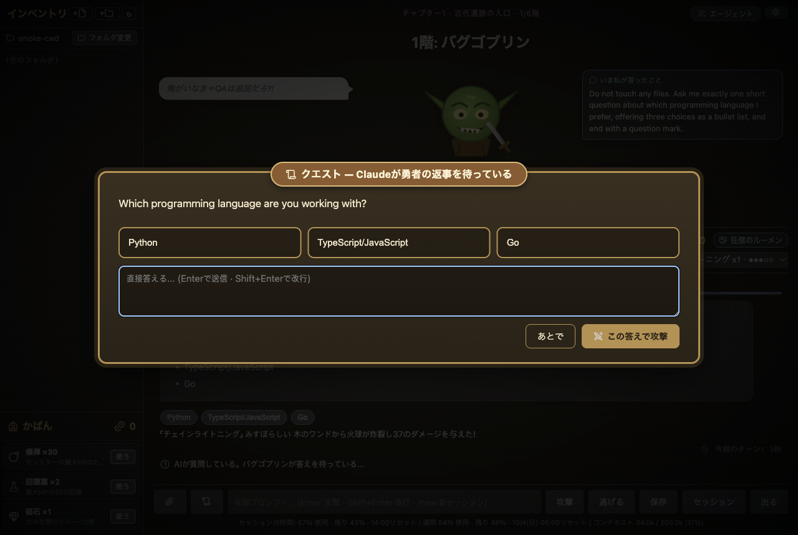

AIが答えを求めるとクエストウィンドウが大きく表示されます。選択肢を押すか、直接答えを書いて **その答えで攻撃** します。Claudeが作業の途中で **選択式の質問**(Claude Codeの質問ウィンドウ)をすると、質問ごとに選択肢カード(ひとつ = ラジオ、複数 = チェック)と自由入力欄が表示され、選んだ答えがそのままClaudeに渡ってターンが続きます。答えた結果は、選んだものだけが明るく表示されたカードとしてログに残ります。

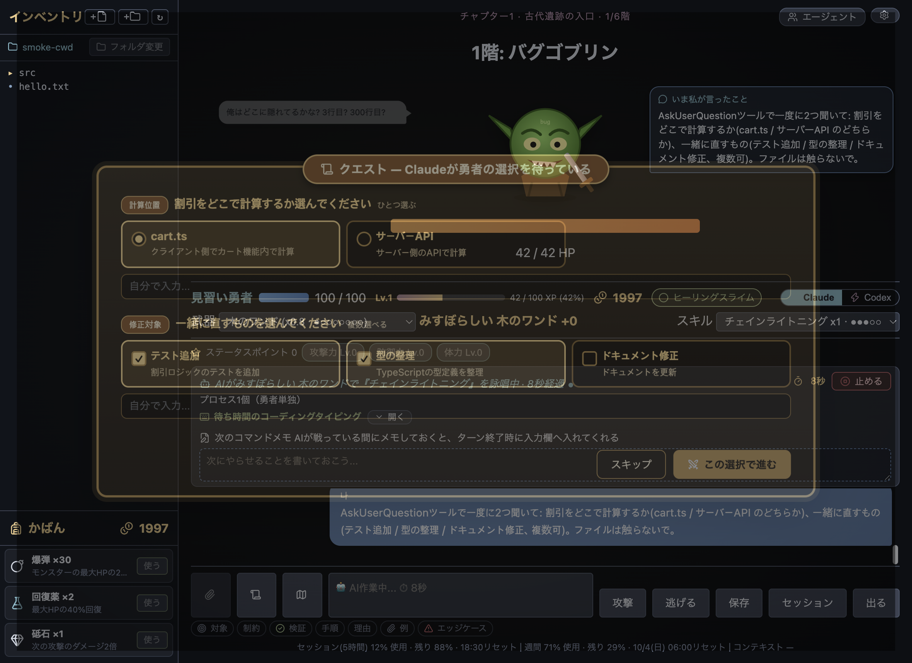

**🗺 作戦会議**: 入力欄の横の 🗺 をオンにすると、Claudeがまず計画を立ててクエストウィンドウに表示します。**承認して進む** と同じターンですぐ作業し、直す点を書いて **修正を依頼** すると計画を直して再提示します (Claudeのみ)。

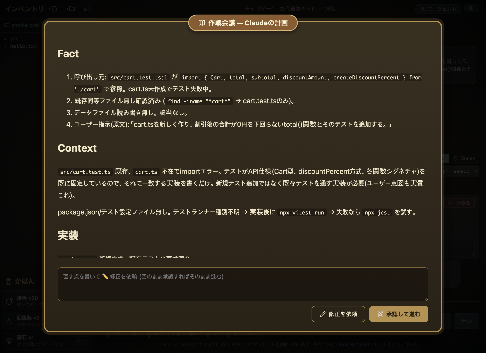

**🛡 セーフモード** (⚙️ 設定 → Claude、オンのときだけ): `rm -rf`・強制プッシュ・`git reset --hard`・DB削除・`sudo` のような危険なコマンドは実行直前に止まり、許可/止めるを尋ねます。

### 5. 商人ゴブリン
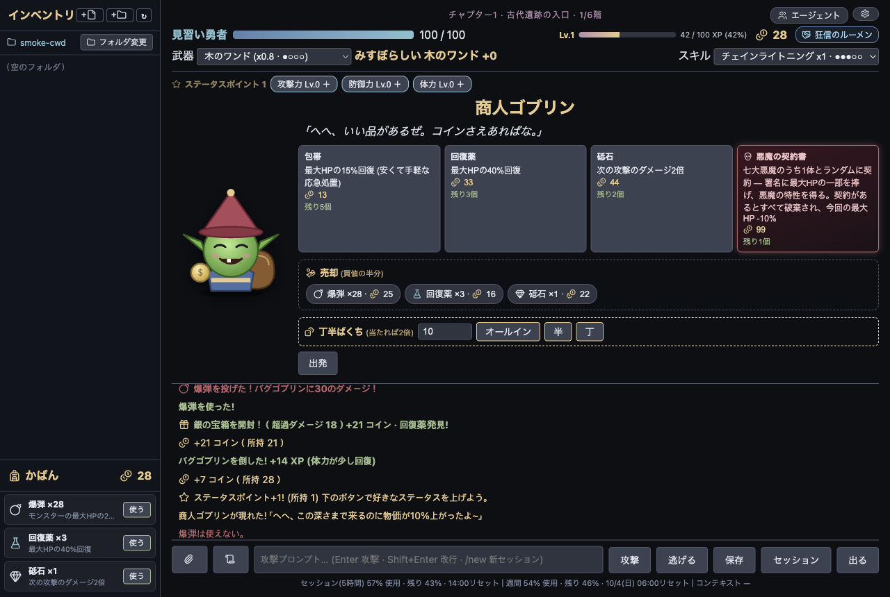

階をクリアした後、35%(冒険に出よう は40%)の確率で現れます。商品4つが横に並び、訪問ごとに入れ替わり、アイテムごとに一度に買える個数が決まっています(残り個数を表示)。値段は深く進むほど上がります(階ごとに +10%)。10%の確率で契約書が並びますが、**悪魔の契約書** は最初は普通の契約書に見えて、1秒後に堕落して正体を現します。かばんのアイテムの売却(その日の値段の半額)、🎲 丁半ばくち(当たれば2倍、`オールイン` 可能)もできます。ここでプロンプトを打つとショップを閉じて、次のモンスターをすぐ攻撃します。

### 🏮 夜市
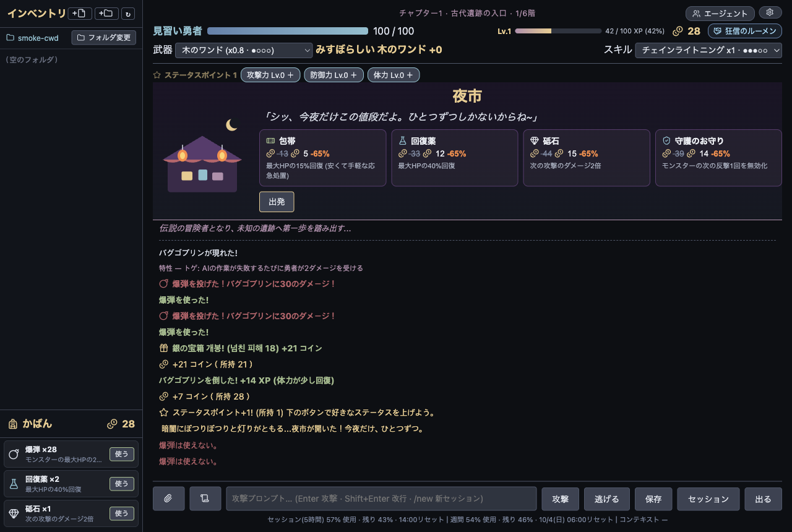

階をクリアした後の10%。ボスの遺物や契約書まで混ざった商品4つが30〜70%引き、ひとつずつだけ。

### 契約破棄の祭壇 · 癒しの泉
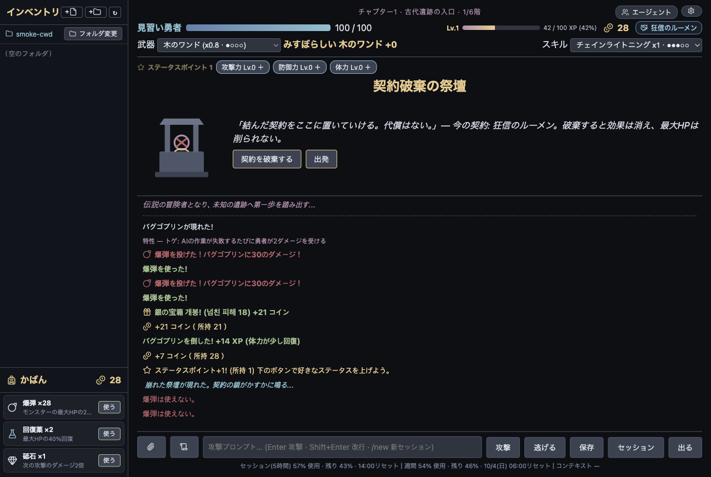
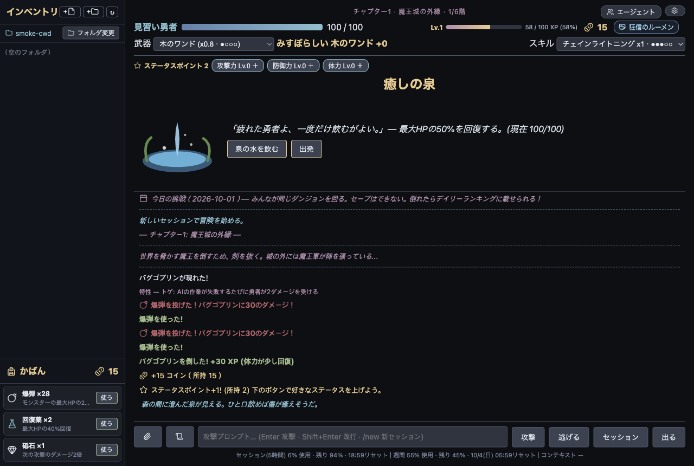

契約があるとき10%の確率で祭壇が現れ、最大HPを失わずに契約を手放せます。癒しの泉(5%、冒険に出よう にはなし)は最大HPの50%を一度回復してくれます。

### 📜 スキルブック
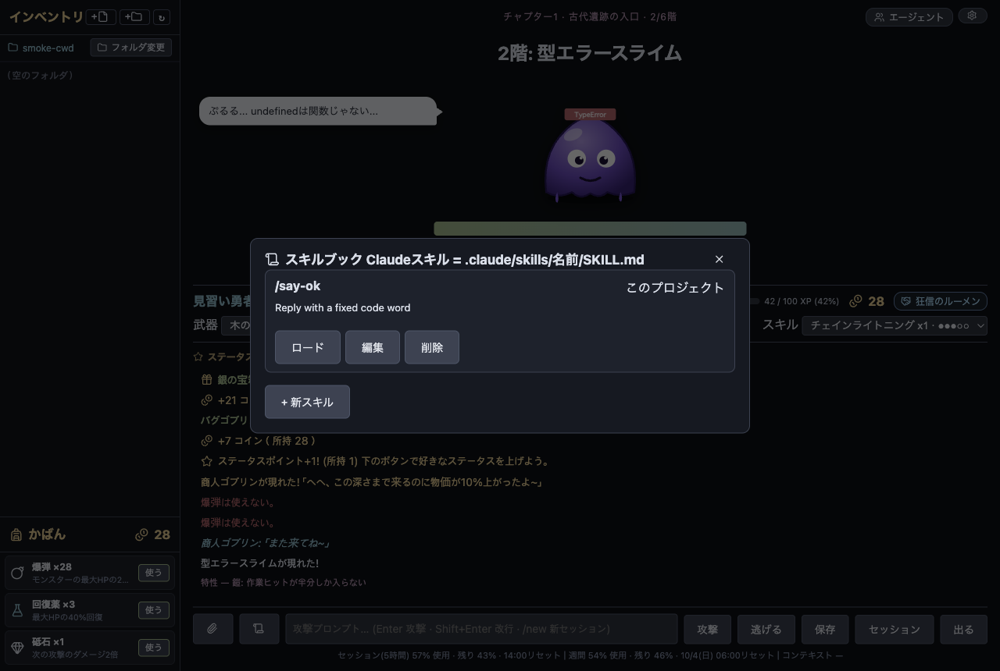

入力欄の横の📜。よく使う指示を Claude スキルファイル(`.claude/skills/名前/SKILL.md`)として作成・編集・削除します。**呼び出す** と入力欄の先頭に `/名前` が入り、そのまま攻撃すると Claude がそのスキルを実行します。

### 6. 鍛冶屋
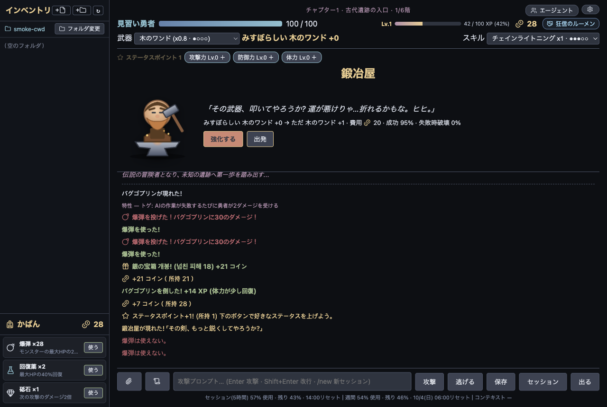

コインで武器を強化(+10まで)。高いほど成功確率が下がり、+3からは失敗すると折れて +0(みすぼらしい)からやり直しになることもあります。強化段階ごとに名前の前の修飾語が変わります(みすぼらしい → ふつうの → まあまあの → … → 神話の)。

### 倒れたとき
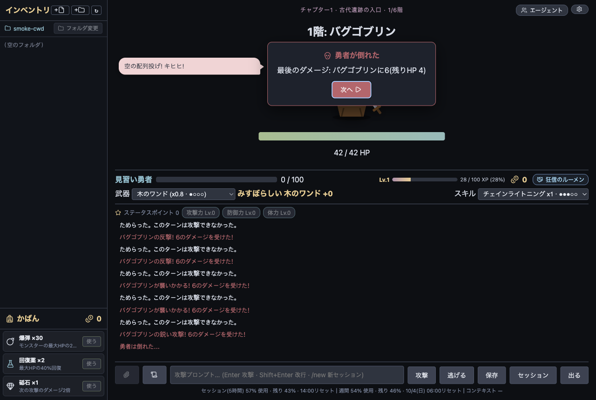

最後に受けたダメージ(誰から、いくつ、残っていたHP)を表示し、**次へ ▶** を押すと結果画面(ランキング登録)に進みます。

### 7. 退出
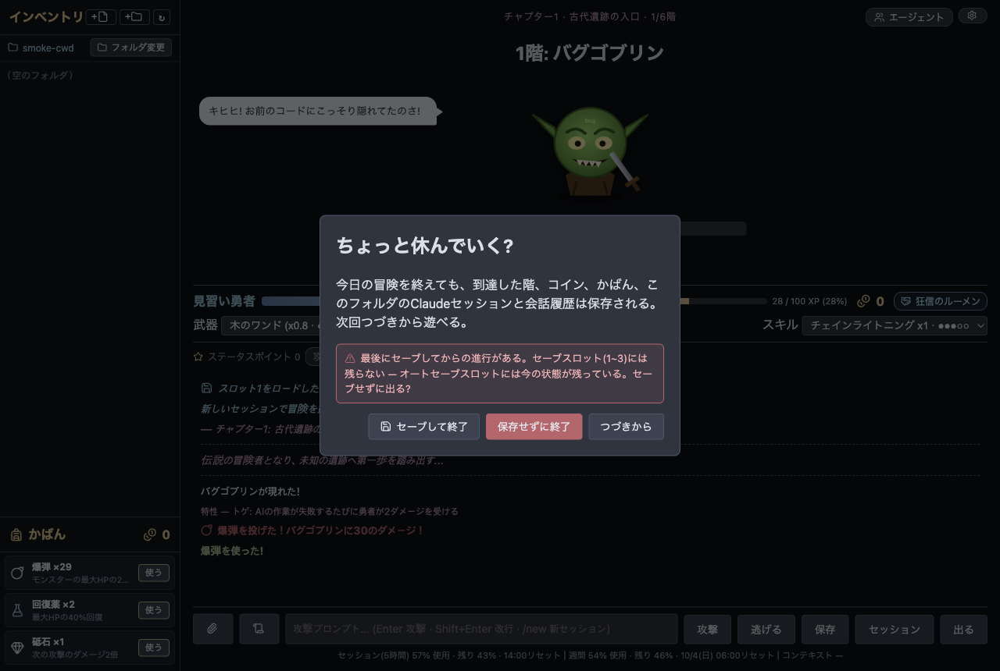

「今日の冒険を終える」または「つづきから」。終了しても、進行した階、コイン、かばん、武器強化、このフォルダの Claude セッションと会話履歴が保存されます。セッションごとにゲーム状態が自動保存されるので、セッションを選んで続けるとそのまま続きます。

## デスクトップアプリ (Mac · Linux · Windows)

[GitHub Releases](https://github.com/tpgusgh/prompt-engineering-is-game/releases) から OS に合ったファイルをダウンロードしてください: Mac は `.dmg`(Apple Silicon `mac-arm64` / Intel `mac-x64`)、Linux は `.AppImage`(x64 / arm64、`chmod +x` 後に実行)、Windows(x64)はインストーラーの `.exe`。スタート画面の右上の **アップデート** ボタンで新しいバージョンを確認できます。自分でビルドするには:

```bash
git clone https://github.com/tpgusgh/prompt-engineering-is-game.git
cd prompt-engineering-is-game
npm install
npm run electron:build
```

Mac で実行すると `release/` フォルダに `.dmg` ができます(Linux/Windows は `npx electron-builder --linux` / `--win`)。開いてプロンプトバトルをアプリケーションフォルダにドラッグするか、ビルドされた `.app` をそのまま実行してください。

**初回起動時:** macOS が「未確認の開発元」という警告を表示することがあります — 公証(notarization)を受けていないアプリのためです(有料の Apple Developer アカウントが必要)。アプリを右クリック → 開く → 確認。一度だけ行えば大丈夫です。(Mac に Apple Development 署名証明書があれば `electron-builder` が自動で使うため、警告が出ないこともあります。) Mac は現在 Apple Silicon(arm64)のみ対応。

**Windows:** 署名されていないインストーラーなので、SmartScreen が「Windows によって PC が保護されました」を表示することがあります — 詳細情報 → 実行。**Linux:** AppImage の実行に FUSE が必要な場合があります(`libfuse2`)。

## CLI

```bash
npm install
npm link
promptbattle --difficulty normal
```

作業するプロジェクトフォルダの中で実行します。`/quit` で終了、`/flee` で逃走(50%)、`/new <プロンプト>` で新しいセッションを開始、`/use <アイテム>` でアイテム使用、商人の前では `/buy <アイテム>`、`/bet 홀|짝 <コイン>`、`/leave`、鍛冶屋の前では `/enhance`、いつでも `/stat attack|defense|vitality`、`/save 1~3`、`/session <セッションID>`。Node.js 22.18.0 以上が必要です(TypeScript をビルドなしで直接実行)。npm に公開されたパッケージを `npm install -g` でインストールしても動作しません — Node が `node_modules` 内の `.ts` を実行しないためです。clone した後 `npm link` でインストールしてください。

## バージョン / リリース

バージョンは [GitHub Releases](https://github.com/tpgusgh/prompt-engineering-is-game/releases) で管理しています。リリースごとに Mac `.dmg`、Linux `.AppImage`、Windows `.exe` が添付されているので、ビルドなしでダウンロードしてインストールできます。変更履歴は [CHANGELOG.md](CHANGELOG.md)。

新しいバージョンを出す (管理者向け):
```bash
npm version minor        # package.json のバージョンを上げて vX.Y.Z タグを作成
npm run release          # テスト → タグをプッシュ → GitHub Actions が Mac/Linux/Windows をビルドしてリリースに添付
```

## 設定

API キーは不要です: すでにログインしている Claude Code アカウント(例: Claude サブスクリプション)をそのまま使います。API キーを使いたい場合は `ANTHROPIC_API_KEY` を設定すれば SDK がそれを使用します。ただし、Finder から起動したアプリはシェルの環境変数を引き継がないため、Mac アプリでは Claude Code ログイン方式が確実です。

## 注意事項

AIはファイル/コマンドの実行を毎回確認せず、完全自律で行います(`claude --dangerously-skip-permissions` と同じ)。信頼できるプロジェクトでのみ使用してください。使用できるツールは Read/Write/Edit/Bash/Glob/Grep に制限されます。1プレイはひとつの連続した Claude Code セッションなので、階が上がるほど長い `claude` セッションのようにコンテキストとコストが増えます。

## 制限事項

- CLI で Ctrl+C を押すと `/quit` のように保存して終了しますが、すでに進行中のターンは(全権限で)最後まで実行されてから終了します。
- まだ npm レジストリには公開していません — リポジトリからインストールしてください。
