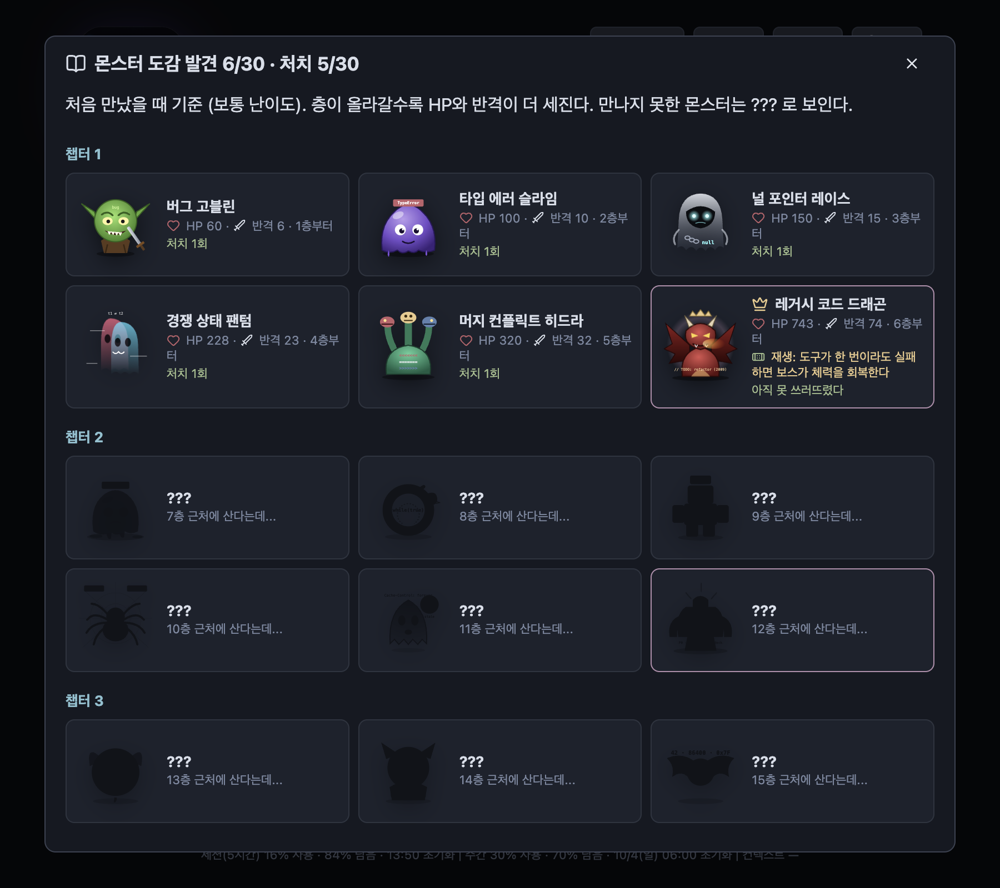

<p align="center"></p>

# 프롬프트 배틀

**한국어** | [English](README.en.md)

실제 AI 코딩을 턴제 RPG로 감싼 게임. 입력하는 프롬프트가 곧 공격이다 — 길고 구체적일수록 더 세게 때린다. 그리고 게임 속에서 AI가 Claude Agent SDK로 내 프로젝트의 파일을 실제로 읽고, 고치고, 명령어를 실행한다.

## 기능

- **프롬프트 = 공격** — 길수록, 키워드가 들어갈수록 데미지 증가. 키워드 2종류 이상이면 크리티컬. 한글/영어 둘 다 인식: 단계별·차근차근 (step by step), 테스트·검증 (test), 엣지 케이스·예외 상황·경계값 (edge case), 리팩토링 (refactor), 왜·이유 (why), 예시·예제 (example).
- **실시간 타격 (일한 만큼)** — AI가 명령을 실행하거나 파일을 고치는 작업이 성공할 때마다 그 순간 타격(프롬프트 데미지의 25%, 1~12)이 들어가고, 턴이 끝나면 프롬프트 데미지 전체가 마무리 일격. 실패한 작업은 타격 없음. 작업 중 **⏹ 멈추기**로 턴을 바로 멈출 수 있고, 몬스터 오른쪽에는 **내가 방금 한 말**이 떠 있다. 건드린 파일은 실제 파일 아이콘이 몬스터에게 날아간다.
- **경험치 바 · 레벨 보상 · 칭호** — 다음 레벨까지 몇 % 찼는지 체력바처럼 표시(100 XP마다 레벨 업). 새 판은 **용사 레벨만큼 능력치 포인트**를 받고 시작하고, 레벨에 따라 칭호가 바뀐다(견습 용사 → 초보 모험가 → … → 전설의 프롬프터 → AI 파티의 왕). 전투 중 몬스터를 쓰러뜨리면 바로 차오르고 레벨 업 알림이 뜬다.
- **몬스터 30종 · 도감** — 챕터마다 다른 몬스터 6종(마지막은 보스)이 5개 조합으로 돌아간다: 버그 고블린, 메모리 릭 젤리, SQL 인젝션 뱀파이어, 부동소수점 유령, AI 환각 키메라 등. **📖 도감**에서 만난 몬스터의 그림·HP·반격 피해·보스 규칙·처치 횟수를 볼 수 있고, 못 만난 몬스터는 실루엣으로 보이고, 처치한 몬스터는 눌러서 특성·성격·대사를 볼 수 있다. 몬스터마다 **특성**이 하나씩 있다: 갑옷(작업 타격 절반), 재생(턴마다 회복), 흉포(반격 +30%), 가시(작업이 실패하면 용사가 피해), 허약(마무리 +25%), 키워드 약점(크리티컬 +30%), 테스트 약점(테스트 통과 턴 1.5배).
- **보스 규칙** — 챕터 보스마다 특수 규칙: 도구가 실패하면 회복 / 테스트가 통과해야만 피해 / 한 턴에 파일 3개 이상 수정해야 피해 / 120자 이하로 짧게 명령해야 피해.
- **업적 · 오늘의 퀘스트 · 기록** — 첫 보스 처치, 크리티컬 10회, 무기 +5, 도감 완성 등 업적 16개(달성하면 코인). 매일 바뀌는 퀘스트("테스트 3번 통과시키기" 등). **📊 기록**에서 처리한 토큰, 최고 한 방, 가장 긴 턴, 무기(모델)별 승률 확인.
- **몬스터 말풍선** — 몬스터가 말풍선으로 떠든다: 가만히 있을 땐 계속 말이 바뀌고, 맞을 때·때릴 때·죽을 때 등 상황마다 몬스터별 대사. 상인과 대장장이도 말을 건다.
- **플레이어 HP** — 턴이 끝나도 살아남은 몬스터는 반격한다 (망설이거나 공격이 실패하면 더 아프게). 단 AI가 답장 끝에서 나에게 질문하면 몬스터는 대답을 기다린다. HP 0이면 패배. 층을 클리어하면 체력 회복.
- **직업과 무기 = Claude 모델** — 시작 화면에서 직업(🗡 검사 / 🧙 마법사 / 🏹 궁수)을 고르면 모델마다 무기 이름과 공격 연출이 달라진다. 좋은 모델일수록 강한 무기(x0.8 ~ x1.5), 전투 중에도 교체 가능.

  | 모델 | 🗡 검사 | 🧙 마법사 | 🏹 궁수 |
  |---|---|---|---|
  | Haiku (x0.8) | 단검 | 나무 완드 | 단궁 |
  | Sonnet (x1) | 장검 | 마법지팡이 | 장궁 |
  | Opus (x1.25) | 마검 | 현자의 지팡이 | 마궁 |
  | Fable (x1.5) | 성검 | 대마도사의 오브 | 천궁 |

  강화할 때마다 무기 이름 앞 수식어가 바뀐다: 초라한 → 그냥 → 쓸만한 → 제법 좋은 → (직업별: 단단한·예리한 / 마력이 흐르는·마력이 깃든 / 팽팽한·바람을 가르는) → 빛나는 → (영롱한 / 별빛이 서린 / 매의 눈이 깃든) → 찬란한 → 전설의 → 신화의. 예: `초라한 마법지팡이 +0` → `그냥 마법지팡이 +1`.
- **스토리 테마와 챕터** — 모험을 떠나기 / 마왕 잡으러 가기 / 버그 소탕전. 6층마다 챕터 보스가 등장하고, 쓰러뜨리면 다음 이야기가 이어진다. 진행 상황이 저장돼서 다음에 켜면 이어서 할 수 있다.
- **인벤토리** — 사이드바에 프로젝트 파일 트리가 보이고, 파일을 열어서 보거나 직접 수정해서 저장할 수 있다. 파일/폴더를 **드래그해서 다른 폴더로 옮기고**, Finder 등 **외부 파일을 끌어다 놓으면 복사**해서 가져온다(같은 이름이 있으면 `이름 (1)`로). `+📄` `+📁` 버튼으로 선택한 폴더 안에 새 파일/폴더를 만든다. 모든 작업은 프로젝트 폴더 안으로 제한되고 덮어쓰지 않는다. ↻ 새로고침은 애니메이션과 함께 트리를 다시 읽는다.
- **AI 파티 (서브에이전트)** — 🧙 마법사(탐색·조사), 🗡 검사(구현), 🏹 궁수(테스트·검증) 세 명의 Claude 서브에이전트. AI가 일을 나눠 여러 명을 **동시에** 보내면 "프로세스 N개 동시 진행"과 각자 하는 일이 표시된다. 마법사가 움직이면 정령이, 궁수가 움직이면 동료들이, 검사가 움직이면 궁수의 엄호 속에 검사가 공격한다. ⚙️ 설정 → AI 파티에서 **파티 모드**를 켜고 끌 수 있음(토큰을 더 쓰기 때문, 게임 중에도 가능).
- **턴 타이머 & 기다리는 동안 코딩 타자** — AI가 몇 초/몇 분째 작업 중인지 상태 줄과 입력창에 실시간 표시. 기다리는 동안 JavaScript·Python·Go·Rust·SQL·Git·Docker 등 20개 넘는 언어/도구의 코드 한 줄(80종 이상, 랜덤)을 똑같이 타자로 치면 몬스터에게 1 피해, 그 코드가 뭔지 3초간 설명이 뜨고(눌러서 자세히 보기), 다음 코드로 넘어간다. 타수/정확도 표시. 타자 영역의 **⚙️ 언어** 버튼으로 C·C++·Python 등 원하는 언어만 골라 연습할 수 있다.
- **BGM & 효과음** — Suno로 만든 곡 8개: 타이틀, 테마별 전투 곡(모험을 떠나기 / 마왕 / 버그 소탕전), 보스, 상인 상점, 대장간, 퀘스트(AI가 질문할 때). 반복 재생, 장면이 바뀌면 크로스페이드. 타격·크리티컬·피격·코인·강화 성공/실패/파괴·타자 소리 같은 짧은 효과음은 직접 합성. 🔊 버튼과 볼륨 슬라이더로 조절.
- **⚙️ 설정 창** — 시작 화면과 게임 안(오른쪽 위 ⚙️) 어디서나 같은 창. Claude 탭: 🔑 연결 방식(Claude Code 로그인 또는 API 키, 키는 키체인 암호화), ⚡ 공격 속도(= effort, low x0.85 ~ max x1.2, 전투 중에도 변경), 🧩 스킬 켜기/끄기/골라서(검색), 🔌 MCP 서버별 켜기/끄기. 게임 세션에만 적용되고 내 Claude Code 설정은 안 바뀐다. 그 밖에 AI 파티, 🔊 사운드(볼륨·음소거), ⌨️ 코딩 타자 언어 탭.
- **오래 걸리는 일은 전령에게** — 빌드·전체 테스트·설치·학습처럼 오래 걸릴 작업은 🦅 전령 서브에이전트가 백그라운드로 맡고, 시간 제한 없이 끝날 때까지 기다렸다가 Claude가 결과 답변까지 이어서 준다.
- **퀘스트 창** — AI가 사용자에게 답을 요구하면 화면을 크게 채우는 퀘스트 창으로 질문하고, 선택지나 직접 답으로 바로 공격한다.
- **게임 가방** — 파일 인벤토리 아래 🎒 가방에서 붕대(HP 15)·회복 물약(HP 40)·숫돌·부적·연막탄을 턴 소모 없이 사용.
- **도구 카드** — AI가 실행한 명령(Bash), 파일 수정, 읽기는 말풍선과 구분되는 카드로 표시: IN(명령)과 OUT(결과), 실행 중/완료/실패 상태, 긴 결과는 접기/펼치기.
- **보기 편한 AI 응답** — AI 답변이 **실시간으로 타이핑되듯** 말풍선에 써지고, 제목·목록·코드 블록·표가 정리된 마크다운으로 보인다. **중요한 부분은 색으로 강조**: 굵은 글씨, 성공/통과(초록), 실패/오류(빨강), 주의/경고(노랑), 파일 경로(파랑), 코드 블록 문법 강조. 내 메시지는 오른쪽 말풍선, 보내면 항상 맨 아래로 스크롤. 입력창은 여러 줄(Shift+Enter 줄바꿈, Enter 공격)이고 긴 글도 다 보이게 늘어난다. AI가 질문 + 목록으로 물어보면 클릭 가능한 선택지로 바뀐다.
- **세션 관리** — 폴더를 고르면 그 폴더의 Claude Code 세션 목록(터미널 `claude`에서 쓴 세션 포함)에서 이어갈 세션이나 새 세션을 고른다. 전투 중에도 `세션` 버튼으로 다른 세션으로 **바꿔 끼울** 수 있고, 고른 세션의 대화 기록이 로그에 표시된다. 세션마다 게임 상태(층·HP·몬스터 HP·능력치 등)가 **자동 저장**되어, 세션을 골라 이어하면 그 상태 그대로 이어진다. 컨텍스트가 80%를 넘으면 새 세션으로 이어갈 수 있는 `/new ...` 프롬프트를 띄워준다. 게임에서 쓴 세션은 **VS Code Claude Code 세션 목록과 `claude --resume`에도 보인다** (SDK로 만든 세션은 원래 VS Code 목록에서 숨겨지기 때문에, 턴이 끝날 때 내 컴퓨터의 세션 파일 `~/.claude/projects/…/<세션ID>.jsonl`에서 `entrypoint` 표시만 `cli`로 바꾼다. 대화 내용은 그대로이고, 사용량 통계는 SDK로 정상 보고된다).
- **저장 / 불러오기 (슬롯 3개 + 자동 저장)** — 4번째 슬롯은 층이 시작될 때마다 자동으로 저장된다. 전투 중 `저장` 버튼으로 층·HP·코인·가방·능력치·검 강화·Claude 세션을 슬롯에 저장(턴 소모 없음). 시작 화면의 `불러오기`에서 슬롯을 고르면 그 폴더·테마·무기로 그 층부터 다시 시작한다(싸우던 몬스터의 남은 HP도 저장됨).
- **대화 기록** — 내가 친 프롬프트와 AI 답변이 폴더별로 저장되고, 다음에 그 폴더로 들어가면 이전 기록이 먼저 보인다.
- **코인과 상인 고블린** — 층을 클리어하면 코인 획득 (보스는 3배). 클리어 후 가끔(30%) 상인 고블린이 나타난다: 회복 물약(HP 40), 숫돌(다음 공격 2배), 수호의 부적(반격 1회 무효), 연막탄(도망 100%), 생명의 결정(최대 HP +10, 그 판 동안). 가방의 아이템은 턴 소모 없이 사용. 상인 앞에서 **홀짝 도박**도 가능: 코인을 걸고 홀/짝을 고르면 주사위를 굴려 맞히면 2배, 틀리면 건 코인을 잃는다.
- **능력치 성장 (판마다 초기화)** — 매 판 Lv.0부터 시작. 몬스터를 쓰러뜨릴 때마다 능력치 포인트 1개를 얻고, 전투 중 버튼으로 공격력(레벨당 피해 +10%), 방어력(레벨당 받는 반격 -5%), 체력(레벨당 최대 HP +10) 중 하나를 올린다. 능력치당 최대 Lv.10. 판이 끝나면 초기화되고, 저장 슬롯을 불러오면 그 판의 능력치가 돌아온다. (검 강화만 영구. 생명의 결정도 그 판에서만)
- **무기 강화 (대장장이)** — 층 클리어 후 가끔(20%) 대장장이를 만난다. 코인을 내고 무기를 강화(+1강마다 피해 +10%, 최대 +10강). 강화할수록 성공 확률은 떨어지고(+0→+1: 95% … +9→+10: 14%), +3강부터는 실패하면 무기가 **부러져 +0(초라한)부터 다시** 시작할 수도 있다(파괴 확률 10%~40%).
- **사용량 표시** — 화면 맨 아래에 작게 Claude 플랜의 세션(5시간) 한도와 주간 한도가 몇 % 사용됐고 몇 % 남았는지, 언제 초기화되는지, 그리고 지금 대화 세션의 컨텍스트 토큰(사용/최대)이 표시된다. 턴이 끝날 때마다 갱신되고 클릭하면 새로고침. (플랜 한도는 SDK가 퍼센트로만 알려줘서 토큰 수가 아닌 %로 표시. API 키 사용 시에는 표시 안 됨.)
- **도망 / 나가기** — 도망은 50% 확률: 성공하면 보상 없이 다음 층, 실패하면 한 턴을 날리고 반격을 맞는다. 보스에게선 도망 불가. 나가기 버튼은 "오늘 모험 종료하기"(진행 층수·코인·가방·세션 저장, 다음에 그 층부터 이어하기)와 "이어하기"(계속 플레이) 중 선택.

## 화면 둘러보기

### 1. 시작 화면


한 화면에 다 보인다: 📁 프로젝트 폴더를 고르고, **새 모험** 카드에서 테마, **직업**(🗡 검사 / 🧙 마법사 / 🏹 궁수 — 무기 이름이 달라짐), 무기(Claude 모델 — **토큰 ●** 표시로 얼마나 사용량을 먹는지), 난이도를 골라 ▶ 던전 입장. 아래 **이어하기**에서 저장 슬롯 3개와 층마다 자동 저장을 불러온다. 폴더를 고르면 그 폴더의 Claude 세션 목록도 뜬다(💾 자동 저장된 층·HP 표시). 오른쪽 위 **⚙️ 설정**(게임 안에서도 같은 창)의 Claude 탭에서:

- 🔑 **연결 방식**: Claude Code 로그인(CLI) 또는 **API 키** (키체인 암호화 저장, "연결 확인" 버튼)
- ⚡ **공격 속도 = effort**: 매우 빠름(low, 피해 x0.85, 토큰 ●○○○○) ~ 매우 느림(max, x1.2, 토큰 ●●●●●)
- 🧩 **스킬**: 전부 켜기 / 끄기 / 골라서 켜기(검색)
- 🔌 **MCP 서버**: 서버별 켜기/끄기, 연결 상태 표시

게임 세션에만 적용되고 내 Claude Code 설정은 바뀌지 않는다.

### 몬스터 도감


만난 몬스터의 그림·HP·반격 피해·보스 규칙·처치 횟수. 시작 화면 오른쪽 위 **📖 도감**.

### 2. 전투


- **왼쪽 위 인벤토리**: 프로젝트 파일 트리. 드래그로 이동, Finder에서 끌어다 놓기, `+📄` `+📁` 새로 만들기, 클릭해서 보기/수정(⌘S 저장, 저장 안 하고 닫으려 하면 확인 창).
- **왼쪽 아래 🎒 가방**: 붕대·회복 물약·숫돌·수호의 부적·연막탄. `사용` 버튼으로 턴 소모 없이 쓴다.
- **가운데**: 몬스터와 HP, 용사 HP, 무기(모델)와 ⚡ 공격 속도 바꾸기, ⭐ 능력치 포인트(몬스터를 쓰러뜨릴 때마다 +1).
- **로그**: 내 말풍선(오른쪽), AI 답변 말풍선(왼쪽, 실시간 타이핑 + 마크다운 + 중요한 부분 색칠), AI가 실행한 명령·수정·읽기는 **도구 카드**(IN/OUT, 완료·실패 표시)로 따로.
- **아래**: 여러 줄 입력창(Enter 공격, Shift+Enter 줄바꿈), `공격` `도망`(50%) `저장` `세션`(세션 바꾸기) `나가기`, 맨 아래 작게 플랜 사용량(5시간 세션·주간)과 컨텍스트 토큰.

### 3. AI가 일하는 동안: 파티 + 코딩 타자


작업 시간이 실시간으로 뜨고, **AI 파티**(🧙 마법사 탐색 · 🗡 검사 구현 · 🏹 궁수 검증)가 동시에 몇 개의 프로세스로 돌고 있는지, 백그라운드 작업이 몇 개인지 보인다. 오래 걸릴 일은 🦅 **전령** 서브에이전트가 백그라운드로 맡고, 끝나면 Claude가 결과까지 이어서 답한다. 기다리는 동안 **코딩 타자**: 코드 한 줄을 똑같이 치면 몬스터에게 1 피해 + 그 코드 설명(눌러서 자세히).

오른쪽 위 **👥 에이전트** 탭에서는 서브에이전트 최근 10개를 볼 수 있다: 돌고 있는 건 몇 분째인지, 끝난 건 몇 분 동안 돌았는지, 누르면 맡은 일·작업 목록(✓/✗)·최종 보고까지.

### 4. 퀘스트 (AI가 물어볼 때)


AI가 답을 요구하면 퀘스트 창이 크게 뜬다. 선택지를 누르거나 직접 답을 써서 **그 답으로 공격**한다.

### 5. 상인 고블린


층을 클리어하면 가끔 나타난다. 아이템을 코인으로 사고, 🎲 홀짝 도박(맞히면 2배, `올인` 가능)도 할 수 있다. 여기서 프롬프트를 치면 상점을 닫고 다음 몬스터를 바로 공격한다.

### 6. 대장장이


코인으로 무기를 강화(+10까지). 높을수록 성공 확률이 떨어지고, +3부터는 실패하면 부러져 +0(초라한)부터 다시 시작할 수도 있다. 강화 단계마다 이름 앞 수식어가 바뀐다(초라한 → 그냥 → 쓸만한 → … → 신화의).

### 7. 나가기


"오늘 모험 종료하기" 또는 "이어하기". 종료해도 진행 층, 코인, 가방, 무기 강화, 이 폴더의 Claude 세션과 대화 기록이 저장된다. 세션마다 게임 상태가 자동 저장되어 세션을 골라 이어하면 그대로 이어진다.

## 데스크톱 앱 (Mac · Linux · Windows)

[GitHub Releases](https://github.com/tpgusgh/prompt-engineering-is-game/releases)에서 OS에 맞는 파일을 받으면 된다: Mac은 `.dmg`(Apple Silicon `mac-arm64` / Intel `mac-x64`), Linux는 `.AppImage`(x64 / arm64, `chmod +x` 후 실행), Windows(x64)는 설치 `.exe`. 시작 화면 오른쪽 위 **업데이트** 버튼으로 새 버전을 확인할 수 있다. 직접 빌드하려면:

```bash
git clone https://github.com/tpgusgh/prompt-engineering-is-game.git
cd prompt-engineering-is-game
npm install
npm run electron:build
```

Mac에서 실행하면 `release/` 폴더에 `.dmg`가 생긴다 (Linux/Windows는 `npx electron-builder --linux` / `--win`). 열어서 프롬프트 배틀을 응용 프로그램 폴더로 드래그하거나, 빌드된 `.app`을 바로 실행하면 된다.

**처음 실행할 때:** macOS가 "확인되지 않은 개발자" 경고를 띄울 수 있다 — 공증(notarization)을 받지 않은 앱이라서 그렇다 (유료 Apple Developer 계정 필요). 앱을 우클릭 → 열기 → 확인. 한 번만 하면 된다. (Mac에 Apple Development 서명 인증서가 있으면 `electron-builder`가 자동으로 사용해서 경고가 안 뜰 수도 있다.) Mac은 현재 Apple Silicon(arm64)만 지원.

**Windows:** 서명되지 않은 설치 파일이라 SmartScreen이 "Windows의 PC 보호"를 띄울 수 있다 — 추가 정보 → 실행. **Linux:** AppImage 실행에 FUSE가 필요할 수 있다(`libfuse2`).

## CLI

```bash
npm install
npm link
promptbattle --difficulty normal
```

작업할 프로젝트 폴더 안에서 실행. `/quit`로 나가기, `/flee`로 도망(50%), `/new <프롬프트>`로 새 세션 시작, `/use <아이템>`으로 아이템 사용, 상인 앞에서는 `/buy <아이템>`, `/bet 홀|짝 <코인>`, `/leave`, 대장장이 앞에서는 `/enhance`, 언제든 `/stat attack|defense|vitality`, `/save 1~3`, `/session <세션ID>`. Node.js 22.18.0 이상 필요 (TypeScript를 빌드 없이 바로 실행). npm에 배포된 패키지를 `npm install -g`로 설치하면 동작하지 않는다 — Node가 `node_modules` 안의 `.ts`는 실행하지 않기 때문. clone 후 `npm link`로 설치할 것.

## 버전 / 릴리스

버전은 [GitHub Releases](https://github.com/tpgusgh/prompt-engineering-is-game/releases)로 관리한다. 릴리스마다 Mac `.dmg`, Linux `.AppImage`, Windows `.exe`가 첨부되어 있어 빌드 없이 받아서 설치할 수 있다. 변경 내역은 [CHANGELOG.md](CHANGELOG.md).

새 버전 내기 (관리자용):
```bash
npm version minor        # package.json 버전 올리고 vX.Y.Z 태그 생성
npm run release          # 테스트 → 태그 푸시 → GitHub Actions가 Mac/Linux/Windows를 빌드해 릴리스에 첨부
```

## 설정

API 키 필요 없음: 이미 로그인된 Claude Code 계정(예: Claude 구독)을 그대로 사용한다. API 키를 쓰고 싶다면 `ANTHROPIC_API_KEY`를 설정하면 SDK가 그걸 사용한다. 단, Finder에서 실행한 앱은 쉘 환경변수를 물려받지 않으니 Mac 앱에서는 Claude Code 로그인 방식이 확실하다.

## 주의사항

AI는 파일/명령어 실행을 매번 확인받지 않고 완전 자율로 수행한다 (`claude --dangerously-skip-permissions`와 같음). 믿을 수 있는 프로젝트에서만 사용할 것. 사용 가능한 도구는 Read/Write/Edit/Bash/Glob/Grep으로 제한된다. 한 판은 하나의 이어지는 Claude Code 세션이라, 층이 올라갈수록 긴 `claude` 세션처럼 컨텍스트와 비용이 늘어난다.

## 한계

- CLI에서 Ctrl+C를 누르면 `/quit`처럼 저장하고 끝나지만, 이미 진행 중인 턴은 (전체 권한으로) 끝까지 실행된 뒤 종료된다.
- 아직 npm 레지스트리 배포는 안 함 — 저장소에서 설치.
