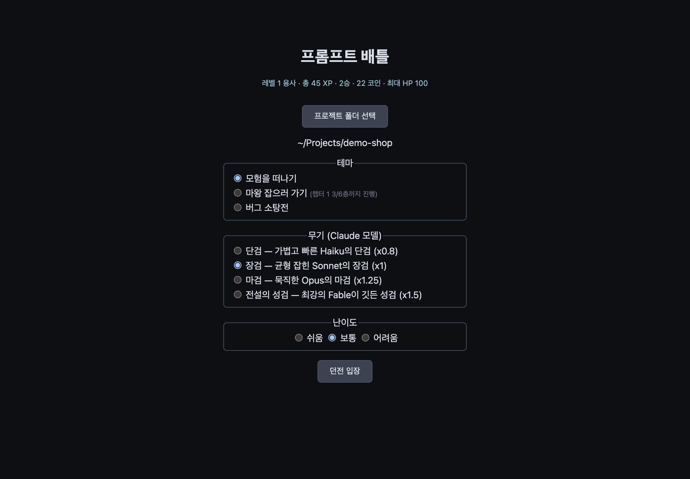
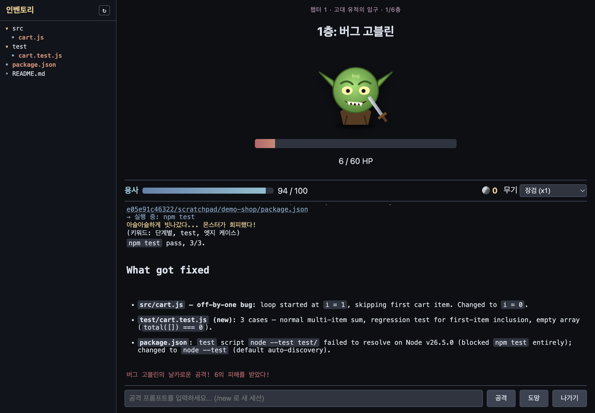
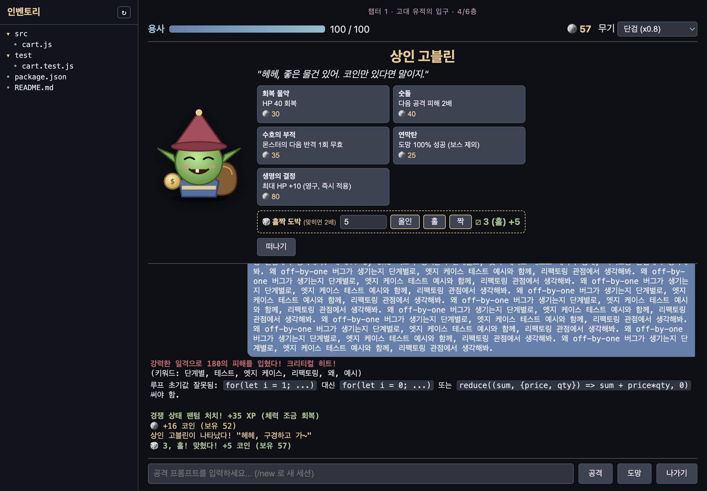
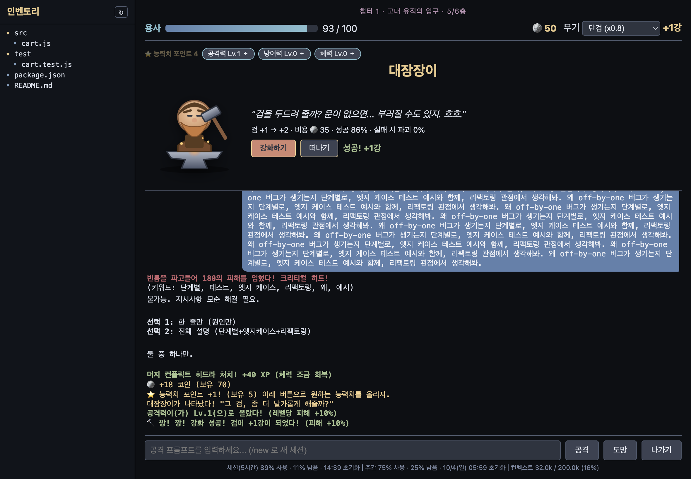
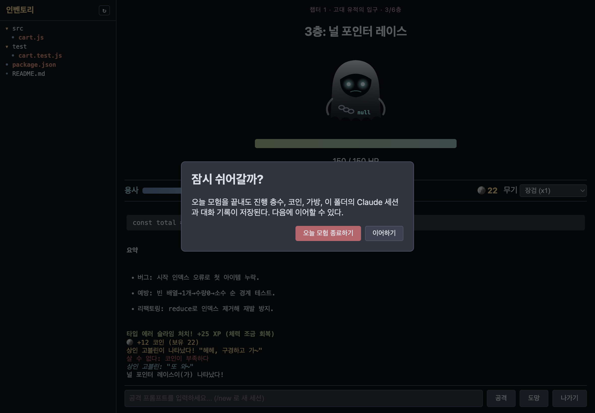

# 프롬프트 배틀

**한국어** | [English](README.en.md)

실제 AI 코딩을 턴제 RPG로 감싼 게임. 입력하는 프롬프트가 곧 공격이다 — 길고 구체적일수록 더 세게 때린다. 그리고 게임 속에서 AI가 Claude Agent SDK로 내 프로젝트의 파일을 실제로 읽고, 고치고, 명령어를 실행한다.

## 기능

- **프롬프트 = 공격** — 길수록, 키워드가 들어갈수록 데미지 증가. 키워드 2종류 이상이면 크리티컬. 한글/영어 둘 다 인식: 단계별·차근차근 (step by step), 테스트·검증 (test), 엣지 케이스·예외 상황·경계값 (edge case), 리팩토링 (refactor), 왜·이유 (why), 예시·예제 (example).
- **실시간 타격** — AI가 명령어를 실행하거나 파일을 수정할 때마다 그 순간 데미지가 들어간다. 건드린 파일은 실제 파일 아이콘이 몬스터에게 날아간다.
- **플레이어 HP** — 턴이 끝나도 살아남은 몬스터는 반격한다 (망설이거나 공격이 실패하면 더 아프게). HP 0이면 패배. 층을 클리어하면 체력 회복.
- **직업과 무기 = Claude 모델** — 시작 화면에서 직업(🗡 검사 / 🧙 마법사 / 🏹 궁수)을 고르면 모델마다 무기 이름과 공격 연출이 달라진다. 좋은 모델일수록 강한 무기(x0.8 ~ x1.5), 전투 중에도 교체 가능.

  | 모델 | 🗡 검사 | 🧙 마법사 | 🏹 궁수 |
  |---|---|---|---|
  | Haiku (x0.8) | 단검 | 나무 완드 | 단궁 |
  | Sonnet (x1) | 장검 | 마법지팡이 | 장궁 |
  | Opus (x1.25) | 마검 | 현자의 지팡이 | 마궁 |
  | Fable (x1.5) | 성검 | 대마도사의 오브 | 천궁 |

  강화할 때마다 무기 이름 앞 수식어가 바뀐다: 초라한 → 그냥 → 쓸만한 → 제법 좋은 → (직업별: 단단한·예리한 / 마력이 흐르는·마력이 깃든 / 팽팽한·바람을 가르는) → 빛나는 → (영롱한 / 별빛이 서린 / 매의 눈이 깃든) → 찬란한 → 전설의 → 신화의. 예: `초라한 마법지팡이 +0` → `그냥 마법지팡이 +1`.
- **스토리 테마와 챕터** — 모험을 떠나기 / 마왕 잡으러 가기 / 버그 소탕전. 6층마다 챕터 보스가 등장하고, 쓰러뜨리면 다음 이야기가 이어진다. 진행 상황이 저장돼서 다음에 켜면 이어서 할 수 있다.
- **인벤토리** — 사이드바에 프로젝트 파일 트리가 보이고, 파일을 열어서 보거나 직접 수정해서 저장할 수 있다. 파일/폴더를 **드래그해서 다른 폴더로 옮기고**, Finder 등 **외부 파일을 끌어다 놓으면 복사**해서 가져온다(같은 이름이 있으면 `이름 (1)`로). `+📄` `+📁` 버튼으로 선택한 폴더 안에 새 파일/폴더를 만든다. 모든 작업은 프로젝트 폴더 안으로 제한되고 덮어쓰지 않는다. ↻ 새로고침은 애니메이션과 함께 트리를 다시 읽는다.
- **AI 파티 (서브에이전트)** — 🧙 마법사(탐색·조사), 🗡 검사(구현), 🏹 궁수(테스트·검증) 세 명의 Claude 서브에이전트. AI가 일을 나눠 여러 명을 **동시에** 보내면 "프로세스 N개 동시 진행"과 각자 하는 일이 표시된다. 마법사가 움직이면 정령이, 궁수가 움직이면 동료들이, 검사가 움직이면 궁수의 엄호 속에 검사가 공격한다. 시작 화면에서 끌 수 있음(토큰을 더 쓰기 때문).
- **턴 타이머 & 기다리는 동안 버그 잡기** — AI가 몇 초/몇 분째 작업 중인지 실시간 표시. 기다리는 동안 3×3 칸에 튀어나오는 버그를 클릭해서 잡으면 턴이 끝날 때 잡은 만큼 코인(턴당 최대 10).
- **보기 편한 AI 응답** — AI 답변이 **실시간으로 타이핑되듯** 말풍선에 써지고, 제목·목록·코드 블록·표가 정리된 마크다운으로 보인다. 내 메시지는 오른쪽 말풍선, 보내면 항상 맨 아래로 스크롤. 입력창은 여러 줄(Shift+Enter 줄바꿈, Enter 공격)이고 긴 글도 다 보이게 늘어난다. AI가 질문 + 목록으로 물어보면 클릭 가능한 선택지로 바뀐다.
- **세션 관리** — 폴더를 고르면 그 폴더의 Claude Code 세션 목록(터미널 `claude`에서 쓴 세션 포함)에서 이어갈 세션이나 새 세션을 고른다. 전투 중에도 `세션` 버튼으로 다른 세션으로 **바꿔 끼울** 수 있고, 고른 세션의 대화 기록이 로그에 표시된다. 컨텍스트가 80%를 넘으면 새 세션으로 이어갈 수 있는 `/new ...` 프롬프트를 띄워준다. 게임에서 쓴 세션은 **VS Code Claude Code 세션 목록과 `claude --resume`에도 보인다** (SDK로 만든 세션은 원래 VS Code 목록에서 숨겨지기 때문에, 턴이 끝날 때 내 컴퓨터의 세션 파일 `~/.claude/projects/…/<세션ID>.jsonl`에서 `entrypoint` 표시만 `cli`로 바꾼다. 대화 내용은 그대로이고, 사용량 통계는 SDK로 정상 보고된다).
- **저장 / 불러오기 (슬롯 3개)** — 전투 중 `저장` 버튼으로 층·HP·코인·가방·능력치·검 강화·Claude 세션을 슬롯에 저장(턴 소모 없음). 시작 화면의 `불러오기`에서 슬롯을 고르면 그 폴더·테마·무기로 그 층부터 다시 시작한다(싸우던 몬스터의 남은 HP도 저장됨).
- **대화 기록** — 내가 친 프롬프트와 AI 답변이 폴더별로 저장되고, 다음에 그 폴더로 들어가면 이전 기록이 먼저 보인다.
- **코인과 상인 고블린** — 층을 클리어하면 코인 획득 (보스는 3배). 클리어 후 가끔(30%) 상인 고블린이 나타난다: 회복 물약(HP 40), 숫돌(다음 공격 2배), 수호의 부적(반격 1회 무효), 연막탄(도망 100%), 생명의 결정(최대 HP +10 영구). 가방의 아이템은 턴 소모 없이 사용. 상인 앞에서 **홀짝 도박**도 가능: 코인을 걸고 홀/짝을 고르면 주사위를 굴려 맞히면 2배, 틀리면 건 코인을 잃는다.
- **능력치 성장 (판마다 초기화)** — 매 판 Lv.0부터 시작. 몬스터를 쓰러뜨릴 때마다 능력치 포인트 1개를 얻고, 전투 중 버튼으로 공격력(레벨당 피해 +10%), 방어력(레벨당 받는 반격 -5%), 체력(레벨당 최대 HP +10) 중 하나를 올린다. 능력치당 최대 Lv.10. 판이 끝나면 초기화되고, 저장 슬롯을 불러오면 그 판의 능력치가 돌아온다. (검 강화와 생명의 결정 최대 HP는 영구)
- **무기 강화 (대장장이)** — 층 클리어 후 가끔(20%) 대장장이를 만난다. 코인을 내고 무기를 강화(+1강마다 피해 +10%, 최대 +10강). 강화할수록 성공 확률은 떨어지고(+0→+1: 95% … +9→+10: 14%), +3강부터는 실패하면 무기가 **부러져 +0(초라한)부터 다시** 시작할 수도 있다(파괴 확률 10%~40%).
- **사용량 표시** — 화면 맨 아래에 작게 Claude 플랜의 세션(5시간) 한도와 주간 한도가 몇 % 사용됐고 몇 % 남았는지, 언제 초기화되는지, 그리고 지금 대화 세션의 컨텍스트 토큰(사용/최대)이 표시된다. 턴이 끝날 때마다 갱신되고 클릭하면 새로고침. (플랜 한도는 SDK가 퍼센트로만 알려줘서 토큰 수가 아닌 %로 표시. API 키 사용 시에는 표시 안 됨.)
- **도망 / 나가기** — 도망은 50% 확률: 성공하면 보상 없이 다음 층, 실패하면 한 턴을 날리고 반격을 맞는다. 보스에게선 도망 불가. 나가기 버튼은 "오늘 모험 종료하기"(진행 층수·코인·가방·세션 저장, 다음에 그 층부터 이어하기)와 "이어하기"(계속 플레이) 중 선택.

## 화면 둘러보기

### 1. 시작 화면


프로젝트 폴더를 고르고 테마, 무기(Claude 모델), 난이도를 선택한다. 현재 능력치와 검 강화 수치도 여기서 확인. 테마 옆에는 저장된 진행 상황(예: `챕터 1 3/6층까지 진행`)이 보이고, "이어하기"를 체크하면 그 층부터 다시 시작한다. 그 폴더에서 전에 쓰던 Claude 세션이 있으면 "이전 세션 이어가기" 체크박스도 나온다.

### 2. 전투


- **왼쪽 인벤토리**: 프로젝트 파일 트리. AI가 건드린 파일은 강조 표시되고, 클릭하면 열어서 보고 수정할 수 있다.
- **위쪽**: 챕터/층 배너, 몬스터와 HP 바.
- **가운데 줄**: 용사 HP, 보유 코인, 무기(모델) 교체 드롭다운. 가방에 아이템이 있으면 그 아래에 버튼으로 나온다.
- **로그**: 내가 친 프롬프트(파란 말풍선), AI가 실행한 명령/수정한 파일(실시간 타격), 크리티컬 키워드, 마크다운으로 정리된 AI 답변, 몬스터 반격. 새 메시지가 오면 항상 맨 아래로 스크롤된다.
- **아래**: 프롬프트 입력창 + `공격` / `도망`(50%) / `나가기`.

위 캡처는 실제 플레이 장면이다. "단계별로 cart.js 버그를 고치고 엣지 케이스 테스트를 추가해줘"라는 프롬프트로 공격하자 AI가 실제로 `src/cart.js`를 고치고 `test/cart.test.js`를 만들고 `npm test`를 돌렸다. 키워드 3개(단계별, test, 엣지 케이스)라 크리티컬.

### 3. 상인 고블린


층을 클리어하면 가끔 나타난다. 아이템을 클릭하면 코인으로 구매한다. 아래 🎲 홀짝 도박에서 걸 코인을 정하고(`올인`도 가능) `홀`/`짝`을 누르면 주사위 결과가 바로 나온다. 다 끝나면 `떠나기`로 다음 층으로 간다. 상인 앞에서 그냥 프롬프트를 치면 상점을 닫고 다음 몬스터를 그 프롬프트로 바로 공격한다.

### 4. 대장장이


현재 강화 수치, 다음 강화 비용, 성공 확률, 실패 시 파괴 확률이 표시된다. `강화하기`를 누르면 바로 결과가 나온다(성공 / 실패 / 💥 파괴). 위쪽의 ⭐ 능력치 포인트 버튼으로 몬스터를 쓰러뜨려 얻은 포인트를 원하는 능력치에 쓴다.

### 5. 나가기


`나가기`를 누르면 "오늘 모험 종료하기"와 "이어하기"를 고를 수 있다. 종료해도 진행 층수, 코인, 가방, 이 폴더의 Claude 세션과 대화 기록이 저장되고, 다음에 같은 폴더를 열면 이전 대화 기록이 로그 맨 위에 보인다.

## Mac 앱

```bash
git clone https://github.com/tpgusgh/prompt-engineering-is-game.git
cd prompt-engineering-is-game
npm install
npm run electron:build
```

`release/` 폴더에 `.dmg`가 생긴다. 열어서 프롬프트 배틀을 응용 프로그램 폴더로 드래그하거나, 빌드된 `.app`을 바로 실행하면 된다.

**처음 실행할 때:** macOS가 "확인되지 않은 개발자" 경고를 띄울 수 있다 — 공증(notarization)을 받지 않은 앱이라서 그렇다 (유료 Apple Developer 계정 필요). 앱을 우클릭 → 열기 → 확인. 한 번만 하면 된다. (Mac에 Apple Development 서명 인증서가 있으면 `electron-builder`가 자동으로 사용해서 경고가 안 뜰 수도 있다.) 현재는 Apple Silicon(arm64)만 지원.

## CLI

```bash
npm install
npm link
promptbattle --difficulty normal
```

작업할 프로젝트 폴더 안에서 실행. `/quit`로 나가기, `/flee`로 도망(50%), `/new <프롬프트>`로 새 세션 시작, `/use <아이템>`으로 아이템 사용, 상인 앞에서는 `/buy <아이템>`, `/bet 홀|짝 <코인>`, `/leave`, 대장장이 앞에서는 `/enhance`, 언제든 `/stat attack|defense|vitality`, `/save 1~3`, `/session <세션ID>`. Node.js 22.18.0 이상 필요 (TypeScript를 빌드 없이 바로 실행). npm에 배포된 패키지를 `npm install -g`로 설치하면 동작하지 않는다 — Node가 `node_modules` 안의 `.ts`는 실행하지 않기 때문. clone 후 `npm link`로 설치할 것.

## 설정

API 키 필요 없음: 이미 로그인된 Claude Code 계정(예: Claude 구독)을 그대로 사용한다. API 키를 쓰고 싶다면 `ANTHROPIC_API_KEY`를 설정하면 SDK가 그걸 사용한다. 단, Finder에서 실행한 앱은 쉘 환경변수를 물려받지 않으니 Mac 앱에서는 Claude Code 로그인 방식이 확실하다.

## 주의사항

AI는 파일/명령어 실행을 매번 확인받지 않고 완전 자율로 수행한다 (`claude --dangerously-skip-permissions`와 같음). 믿을 수 있는 프로젝트에서만 사용할 것. 사용 가능한 도구는 Read/Write/Edit/Bash/Glob/Grep으로 제한된다. 한 판은 하나의 이어지는 Claude Code 세션이라, 층이 올라갈수록 긴 `claude` 세션처럼 컨텍스트와 비용이 늘어난다.

## 한계

- CLI에서 Ctrl+C를 누르면 `/quit`처럼 저장하고 끝나지만, 이미 진행 중인 턴은 (전체 권한으로) 끝까지 실행된 뒤 종료된다.
- 아직 npm 레지스트리 배포는 안 함 — 저장소에서 설치.
